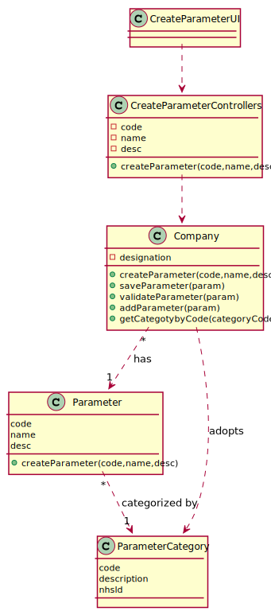

# US 10 - Create Parameter

## 1. Requirements Engineering

*In this section, it is suggested to capture the requirement description and specifications as provided by the client as well as any further clarification on it. It is also suggested to capture the requirements acceptance criteria and existing dependencies to other requirements. At last, identfy the involved input and output data and depicted an Actor-System interaction in order to fulfill the requirement.*

### 1.1. User Story Description

As an Admin I want to create a new parameter and categorize it,in order to know what will be analysed in the Tests.

### 1.2. Customer Specifications and Clarifications 

*Insert here any related specification and/or clarification provided by the client together with **your interpretation**. When possible, provide a link to such specifications/clarifications.*

**From the specifications document:**
>Blood tests are frequently characterized by measuring several parameters which for
presentation/reporting purposes are organized by categories. For example, parameters such
as the number of Red Blood Cells (RBC), White Blood Cells (WBC) and Platelets (PLT) are
usually presented under the blood count (Hemogram) category

**From the client clarifications:**

### 1.3. Acceptance Criteria

* **AC1:** The Code are five alphanumeric characters.
* **AC2:** TThe Short Name is a String with no more than 8 character
* **AC3:** The Description is a String with no more than 20 characters.

### 1.4. Found out Dependencies

*There is a dependencie to "US11 create parameter category" since at least a parameter category must to categorize the parameter.*
### 1.5 Input and Output Data

**Input Data:**

* Typed data:
    * a code,
    * a name,
    * description

* Selected data:
    * Classifying parameter category
      
**Output Data:**

* List of existing parameter categories
* (In)Success of the operation

### 1.6. System Sequence Diagram (SSD)

### 1.7 Other Relevant Remarks

n/a

## 2. OO Analysis

### 2.1. Relevant Domain Model Excerpt 

### 2.2. Other Remarks

n/a

## 3. Design - User Story Realization 

### 3.1. Rationale

**The rationale grounds on the SSD interactions and the identified input/output data.**

| Interaction ID | Question: Which class is responsible for... | Answer  | Justification (with patterns)  |
|:-------------  |:--------------------- |:------------|:---------------------------- |
| Step/Msg 1: starts new parameter		 |		... interacting with the actor?					 |  CreateParameterUI           |     Creator of Parameter Category                         |
| Step 2/Msg 2: request data  		 |	n/a						 |             |                              |
| Step 3/Msg 3: types requested data  		 |	...saving the input data?|  Parameter           |  IE: The object created in step 1 has its own data.                     |
| Step 4/Msg 4: show categories and asks to select one  		 |	...knowing the parameter categories to show?						 |  Company | IE: Parameter Categories are defined by the Company.                             |
| Step 5/Msg 5: saving the selected category  		 |		...saving the selected category					 |             |                              |
| Step 6  		 |							 |             |                              |              

### Systematization ##

According to the taken rationale, the conceptual classes promoted to software classes are: 

 * Company
 * Parameter
 * ParameterCategory

Other software classes (i.e. Pure Fabrication) identified: 
 * CreateParameterUI  
 * CreateParameterController

## 3.2. Sequence Diagram (SD)

## 3.3. Class Diagram (CD)

# 4. Tests

**Test 1:** Check that it is not possible to create an instance of the Parameter class with null values.

	@Test(expected = IllegalArgumentException.class)
		public void ensureNullIsNotAllowed() {
		Parameter instance = new PArameter(null, null, null, null, null, null, null);
	}
**Test 2:** Check that it is not possible to create an instance of the Parameters class with a code containing less than five chars - AC2.

	@Test(expected = IllegalArgumentException.class)
		public void ensureReferenceMeetsAC2() {
		ParameterCategory cat = new ParameterCategory(10000, "Category 10", null);
		
		Parameter instance = new Parameter("1111", "BFD", "description",cat);
	}

*It is also recommended to organize this content by subsections.* 

# 5. Construction (Implementation)

*In this section, it is suggested to provide, if necessary, some evidence that the construction/implementation is in accordance with the previously carried out design. Furthermore, it is recommeded to mention/describe the existence of other relevant (e.g. configuration) files and highlight relevant commits.*

*It is also recommended to organize this content by subsections.* 

# 6. Integration and Demo 

*In this section, it is suggested to describe the efforts made to integrate this functionality with the other features of the system.*

# 7. Observations

*In this section, it is suggested to present a critical perspective on the developed work, pointing, for example, to other alternatives and or future related work.*

