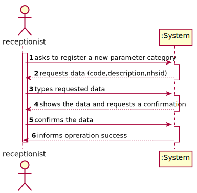
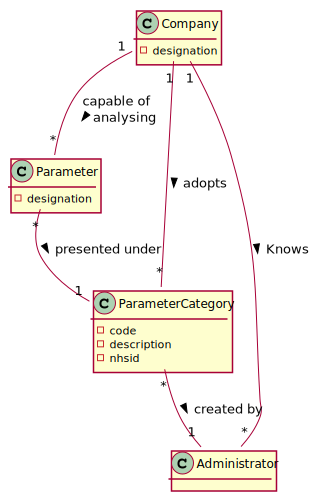
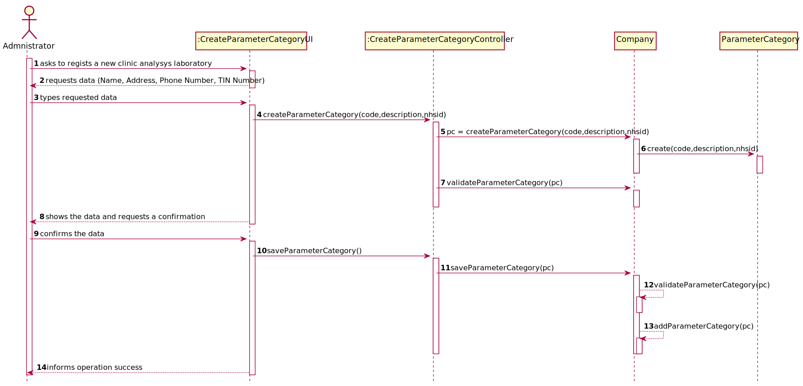
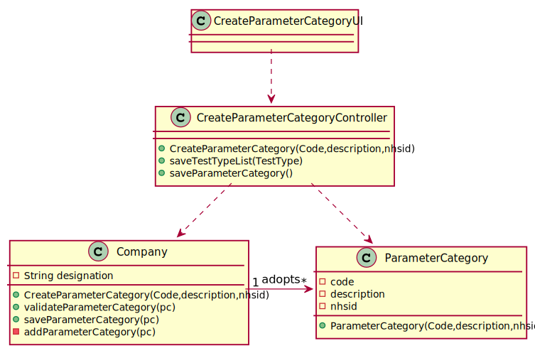

# US 11 - Create Parameter Category

## 1. Requirements Engineering

### 1.1. User Story Description

As an **administrator**, I want to specify a new **parameter category**.

### 1.2. Customer Specifications and Clarifications 

* **From the Specifications Document:**
>* “Blood tests are frequently characterized by measuring several parameters which for presentation/reporting purposes are organized
by categories. For example, parameters such as the number of Red Blood Cells (RBC), White Blood Cells (RBC) and Platelets (PLT) are
usually presented under the blood count (Hemogram) category.”
>* “Regardless, such tests rely on measuring one or more parameters that can be grouped/organized by categories.”

* **From the client clarifications:**
>* Question: What are the data that characterize a parameter category?
>   * Answer: Simply consider a code, a description and an NHS identifier
### 1.3. Acceptance Criteria

* AC1: Code must be unique having 4 to 8 chars
* AC2: Description cannot be empty and has, at maximum, 40 chars
* AC3: NHS identifier is not mandatory
### 1.4. Found out Dependencies

No dependencies were found.
### 1.5 Input and Output Data
**Input Data**
* **Typed data**: code, description and NHS identified
* **Selected data**: (none)
**Output Data**
* (In)Success of the operation

### 1.6. System Sequence Diagram (SSD)

*Insert here a SSD depicting the envisioned Actor-System interactions and throughout which data is inputted and outputted to fulfill the requirement. All interactions must be numbered.*

### 1.7 Other Relevant Remarks
* n/a
## 2. OO Analysis

### 2.1. Relevant Domain Model Excerpt 

### 2.2. Other Remarks

* n/a

## 3. Design - User Story Realization 

### 3.1. Rationale

**The rationale grounds on the SSD interactions and the identified input/output data.**

| Interaction ID | Question: Which class is responsible for... | Answer  | Justification (with patterns)  |
|:-------------  |:--------------------- |:------------|:---------------------------- |
| Step/Msg 1: starts new parameter category		          |... instantiating a new Parameter Category?| Company  | Creator of Parameter Category            |
| Step/Msg 2: requests data		                          |	n/a						      |          |                              |
| Step/Msg 3: types requested data		                  |	...saving the input data?     | Parameter Category   | IE:The objet created has its own data|
| Step/Msg 4: shows the data and requests a confirmation  |...validate the data locally?  | Parameter Category   | IE:knows its own data                             |
|                                                         |...validate the data globally  | Company  | IE:knows all the Parameter Category                              |
| Step/Msg 5: confirms the data		                      |... saving the created parameter category? | Company  | IE:Adopts all of the Parameter Category objects                             |
| Step/Msg 6: informs operation success		          |...imform the operation success|  ui      | IE:Responsible for user interaction                             |

### Systematization ##

According to the taken rationale, the conceptual classes promoted to software classes are: 

* ParameterCategory
* Company

Other software classes (i.e. Pure Fabrication) identified: 

* CreateParameterCategoryUI
* CreateParameterCategoryController

## 3.2. Sequence Diagram (SD)

## 3.3. Class Diagram (CD)

# 4. Tests 
*In this section, it is suggested to systematize how the tests were designed to allow a correct measurement of requirements fulfilling.* 

**_DO NOT COPY ALL DEVELOPED TESTS HERE_**

**Test 1:** Check that it is not possible to create an instance of the Example class with null values. 

	@Test(expected = IllegalArgumentException.class)
		public void ensureNullIsNotAllowed() {
		Exemplo instance = new Exemplo(null, null);
	}

*It is also recommended to organize this content by subsections.* 

# 5. Construction (Implementation)

*In this section, it is suggested to provide, if necessary, some evidence that the construction/implementation is in accordance with the previously carried out design. Furthermore, it is recommeded to mention/describe the existence of other relevant (e.g. configuration) files and highlight relevant commits.*

*It is also recommended to organize this content by subsections.* 

# 6. Integration and Demo 

*In this section, it is suggested to describe the efforts made to integrate this functionality with the other features of the system.*

# 7. Observations

*In this section, it is suggested to present a critical perspective on the developed work, pointing, for example, to other alternatives and or future related work.*

