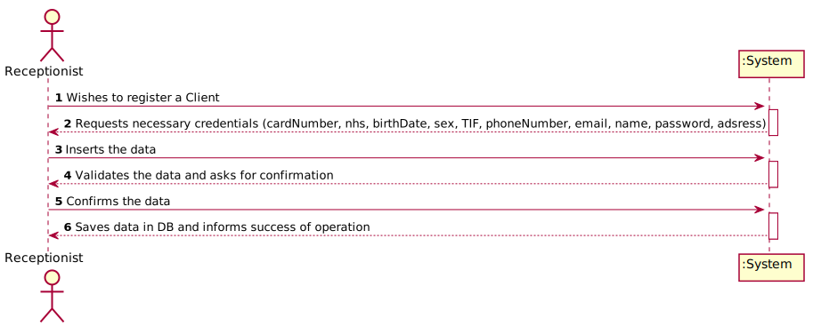

# US 006 - To create a Task 

## 1. Requirements Engineering

### 1.1. User Story Description

As an organization employee, I want to create a new task in order to be further published.

### 1.2. Customer Specifications and Clarifications 

**From the specifications document:**

> "Typically, the client arrives at one of the clinical analysis laboratories with a lab order prescribed by
a doctor. Once there, a receptionist asks the client’s citizen card number, the lab order (which
contains the type of test and parameters to be measured), and registers in the application the test to
be performed to that client."
>
> "In case of a new client, the receptionist registers the client in the application. To register a client, the
receptionist needs the client’s citizen card number, National Healthcare Service (NHS) number,
birth date, sex, Tax Identification number (TIN), phone number, e-mail and name."

**From the client clarifications:**

> **Question:** What attributes a Receptionist have? 
>
>**Answer:** 
Employee ID;
Organization Role;
Name;
Address;
Phone Number;
E-Mail;
Standard Occupational Classification (SOC) code.

### 1.3. Acceptance Criteria

* **AC1:** The client should be a system user.
* **AC2:** The "auth" component available must be reused.
* **AC3:** Accepted formats for the input data : Name can have a maximum of 35 characters; Citizen Card must have a 16 digit number; NHS must have a 10 digit number; Birth Date must be in DD/MM/YYYY format; Phone number must have an 11 digit number.

### 1.4. Found out Dependencies

* There is a dependency to "US007 Register an Employee" since at least a employee must exist to classify him/her as Recepcionist in order to register a client.

### 1.5 Input and Output Data

**Input Data:**

*Input Data*

*Typed Data: 
	*Name; 
	*Address; 
	*Phone Number; 
	*E-Mail; 
	*Citizen Card number; 
	*TIN number; 
	*Birth date; 
	*Sex.

**Output Data:**

* List of existing task categories
* (In)Success of the operation

### 1.6. System Sequence Diagram (SSD)

### 1.7 Other Relevant Remarks

## 2. OO Analysis

### 2.1. Relevant Domain Model Excerpt 

### 2.2. Other Remarks

n/a

## 3. Design - User Story Realization 

### 3.1. Rationale

| Interaction ID | Question: Which class is responsible for... | Answer  | Justification (with patterns)  |
|:-------------  |:--------------------- |:------------|:---------------------------- |
| Step 1  		 |	... interacting with the actor? | RegisterClientUI |  Pure Fabrication: there is no reason to assign this responsibility to any existing class in the Domain Model.           |
| 			  		 |	... coordinating the US? | CreateTaskController | Controller                             |
| 			  		 |	... instantiating a new Task? | RegisterClientController | Creator (Rule 1): in the DM Organization has a Task.   |
| 			  		 |	... knowing the user using the system? | UserSession | IE: has registed all Users |
| 			  		 |							 | Company | IE: knows/has its clients|
| 			  		 |							 | Client | IE: knows theirs information (e.g. email) |
| Step 2  		 |	...saving the inputted data? | ClientStore | IE: object created in step 1 has its own data.  |
| Step 3  		 |	... validating all data (local validation)? | Client | IE: owns its data.| 
| 			  		 |	... validating all data (global validation)? | Company| IE: knows all its clients.| 
| 			  		 |	... saving the client? | Client | IE: owns all its clients.| 
| Step 4  		 |	... informing operation success?| RegisterClientUI  | IE: is responsible for user interactions.  | 

### Systematization ##

According to the taken rationale, the conceptual classes promoted to software classes are: 

 * Company
 * Client
 * ClientStore

Other software classes (i.e. Pure Fabrication) identified: 

 * RegisterClientController
 * RegisterClientUI  

## 3.2. Sequence Diagram (SD)

## 3.3. Class Diagram (CD)

# 4. Tests 

**Test 1:** Check that it is not possible to create an instance of the Task class with null values. 

	@Test(expected = IllegalArgumentException.class)
		public void ensureNullIsNotAllowed() {
		Task instance = new Task(null, null, null, null, null, null, null);
	}
	

**Test 2:** Check that it is not possible to create an instance of the Task class with a reference containing less than five chars - AC2. 

	@Test(expected = IllegalArgumentException.class)
		public void ensureReferenceMeetsAC2() {
		Category cat = new Category(10, "Category 10");
		
		Task instance = new Task("Ab1", "Task Description", "Informal Data", "Technical Data", 3, 3780, cat);
	}

*It is also recommended to organize this content by subsections.* 

# 5. Construction (Implementation)

## Class CreateTaskController 

		public boolean createTask(String ref, String designation, String informalDesc, 
			String technicalDesc, Integer duration, Double cost, Integer catId)() {
		
			Category cat = this.platform.getCategoryById(catId);
			
			Organization org;
			// ... (omitted)
			
			this.task = org.createTask(ref, designation, informalDesc, technicalDesc, duration, cost, cat);
			
			return (this.task != null);
		}

## Class Organization

		public Task createTask(String ref, String designation, String informalDesc, 
			String technicalDesc, Integer duration, Double cost, Category cat)() {
		
	
			Task task = new Task(ref, designation, informalDesc, technicalDesc, duration, cost, cat);
			if (this.validateTask(task))
				return task;
			return null;
		}

# 6. Integration and Demo 

* A new option on the Employee menu options was added.

* Some demo purposes some tasks are bootstrapped while system starts.

# 7. Observations

Platform and Organization classes are getting too many responsibilities due to IE pattern and, therefore, they are becoming huge and harder to maintain. 

Is there any way to avoid this to happen?

