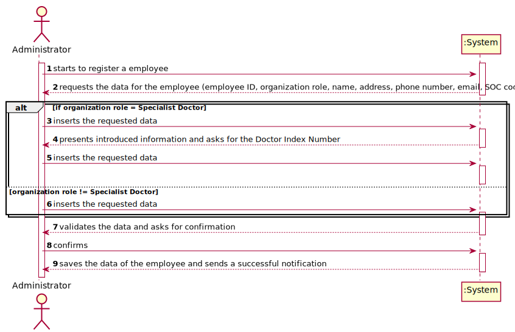
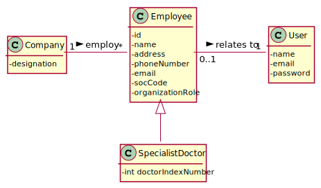
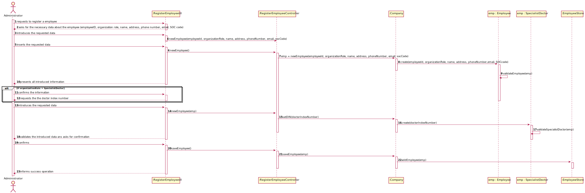
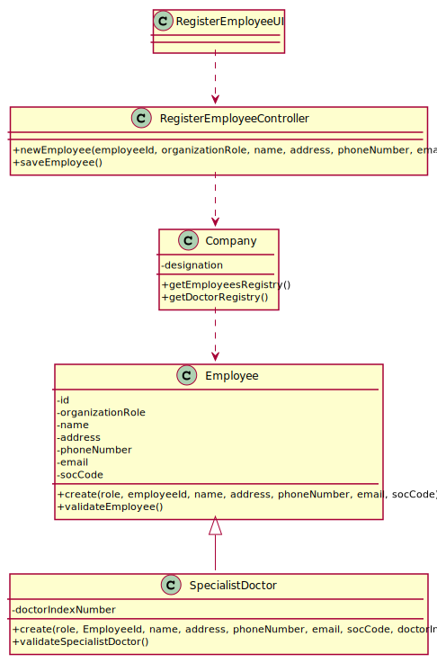

# US 007 - To register a new employee

## 1. Requirements Engineering

### 1.1. User Story Description

As an administrator, I want to register a new employee.

### 1.2. Customer Specifications and Clarifications 

**From the specifications document:**

> Each employee is characterized by having a unique id, 
> the role defined, a name, an address, a phone number, 
> an email and the SOC code. 

> The Specialist Doctor needs to have an additional information, 
> that is the Doctor Index Number.

> Only the Administrator has the capability to register a new 
> employee. 

**From the client clarifications:**

> **Question:** When creating a new employee, the attributes "Employee ID" and "Doctor Index Number", are 
> implemented by the administrator or incremented by the system?
>  
> **Answer:** Only the employee ID should be generated from the initials of the employee name and should include a number. 
> The number has 5 digits and is increases automatically when a new employee is registered in the system. For instance, 
> if the company has 20 employees and wants to register a specialist doctor having the name Ana Maria Santos Moura, then
> the the employee ID for this specialist doctor should be AMSM00021.
> The Doctor Index Number should be introduced by the administrator.

> **Question:** When the application is delivered , should it have default employees , ex:administrator,etc.. , 
> or should be completly empty (without any user or employee).
>  
> **Answer:** One Administrator must be registered before starting the application for the first time.

### 1.3. Acceptance Criteria

* **AC1:** Each user must have a single role defined in the system.
* **AC2:** The "auth" component available on the repository must be reused (without modifications).

### 1.4. Found out Dependencies

* There isn't dependencies.

### 1.5 Input and Output Data

**Input Data:**

* Typed data:
	* a role 
	* a name, 
	* an address
	* a phone number
	* an email
	* a SOC code
	* a doctor index number (in case of role "specialistDoctor")

**Output Data:**

* (In)Success of the operation

### 1.6. System Sequence Diagram (SSD)

**Other alternatives might exist**

### 1.7 Other Relevant Remarks

* The role is important to determine what data to ask to the user.

## 2. OO Analysis

### 2.1. Relevant Domain Model Excerpt 

### 2.2. Other Remarks

The class Employee is an super class that shares attributes with 
Receptionist, MedicalLabTechnician, LabCoordinator
and SpecialistDoctor (that this specific one has an additional attribute)

## 3. Design - User Story Realization 

### 3.1. Rationale

| Interaction ID | Question: Which class is responsible for... | Answer  | Justification (with patterns)  |
|:-------------  |:--------------------- |:------------|:---------------------------- |
| Step 1  		 |	... interacting with the actor? | CreateEmployeeUI   |  Pure Fabrication: there is no reason to assign this responsibility to any existing class in the Domain Model.           |
| 			     |	... coordinating the US? | CreateEmployeeController | Controller                             |
| 			  	 |	... instantiating a new Task? | Organization   | Creator (Rule 1): in the DM Organization has a Employee.   |
| 			  	 | ... knowing the user using the system?  | UserSession  | IE: cf. A&A component documentation.  |
| 			  	 |	... knowing to which organization the user belongs to? | Platform  | IE: has registed all Organizations |
| 			  	 |							 | Organization   | IE: knows/has its own Employees|
| 			  	 |							 | Employee and SpecialistDoctor  | IE: knows its own data (e.g. email) |
| Step 2  		 |	...saving the inputted data? | Employee and SpecialistDoctor  | IE: object created in step 1 has its own data.  |
| Step 3  		 |	...knowing the task categories to show? | EmployeeDto  | IE: Task Categories are defined by the Platform. |
| Step 4  		 |	... saving the selected category? | Employee and SpecialistDoctor | IE: object created in step 1 is classified in one Category.  |
| Step 5  		 |							 |             |                              |              
| Step 6  		 |	... validating all data (local validation)? | Employee and SpecialistDoctor | IE: owns its data.| 
| 			  	 |	... validating all data (global validation)? | Organization | IE: knows all its employees.| 
| 			  	 |	... saving the created task? | Organization | IE: owns all its employees.| 
| Step 7  		 |	... informing operation success?| CreateEmployeeUI  | IE: is responsible for user interactions.  | 

### Systematization ##

According to the taken rationale, the conceptual classes promoted to software classes are: 

 * Company
 * Employee
 * OrgRole
 * Employee
 * SpecialistDoctor

Other software classes (i.e. Pure Fabrication) identified: 

 * RegisterEmployeeUI  
 * RegisterEmployeeController
 * EmployeeDto

## 3.2. Sequence Diagram (SD)

## 3.3. Class Diagram (CD)

# 4. Tests 

**Test 1:** Check that it is not possible to create an instance of the Task class with null values. 

	@Test(expected = IllegalArgumentException.class)
		public void ensureNullIsNotAllowed() {
		Task instance = new Task(null, null, null, null, null, null, null);
	}
	

**Test 2:** Check that it is not possible to create an instance of the Task class with a reference containing less than five chars - AC2. 

	@Test(expected = IllegalArgumentException.class)
		public void ensureReferenceMeetsAC2() {
		Category cat = new Category(10, "Category 10");
		
		Task instance = new Task("Ab1", "Task Description", "Informal Data", "Technical Data", 3, 3780, cat);
	}

*It is also recommended to organize this content by subsections.* 

# 5. Construction (Implementation)

## Class CreateTaskController 

		public boolean createTask(String ref, String designation, String informalDesc, 
			String technicalDesc, Integer duration, Double cost, Integer catId)() {
		
			Category cat = this.platform.getCategoryById(catId);
			
			Organization org;
			// ... (omitted)
			
			this.task = org.createTask(ref, designation, informalDesc, technicalDesc, duration, cost, cat);
			
			return (this.task != null);
		}

## Class Organization

		public Task createTask(String ref, String designation, String informalDesc, 
			String technicalDesc, Integer duration, Double cost, Category cat)() {
		
	
			Task task = new Task(ref, designation, informalDesc, technicalDesc, duration, cost, cat);
			if (this.validateTask(task))
				return task;
			return null;
		}

# 6. Integration and Demo 

# 7. Observations

