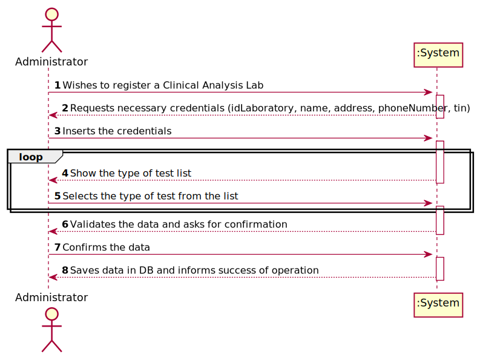
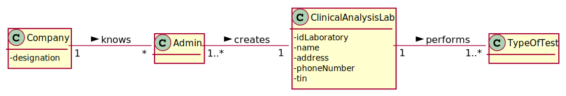
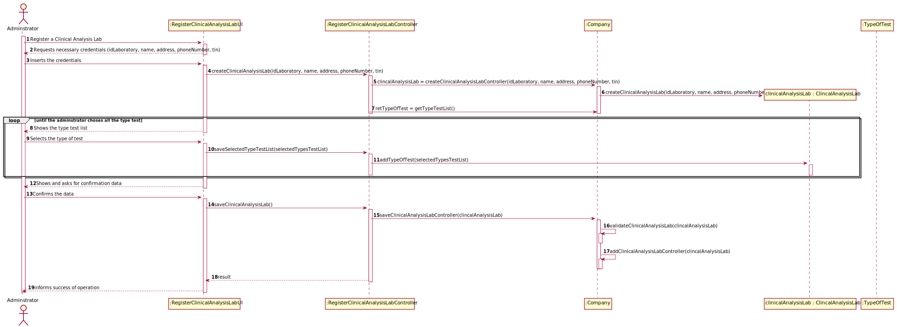
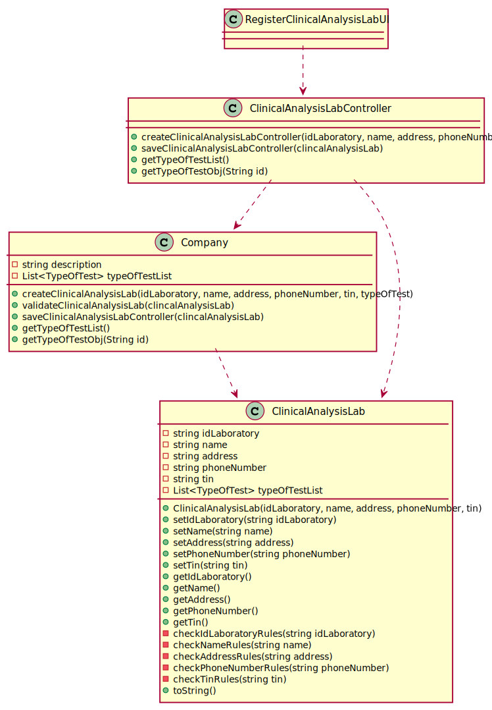

# US 08 - To register a new clinical analysis laboratory

## 1. Requirements Engineering

*In this section, it is suggested to capture the requirement description and specifications as provided by the client as well as any further clarification on it. It is also suggested to capture the requirements acceptance criteria and existing dependencies to other requirements. At last, identfy the involved input and output data and depicted an Actor-System interaction in order to fulfill the requirement.*

### 1.1. User Story Description

*As an administrator, I want to register a new clinical  analysis laboratory stating which kind of test(s) it operates.*

### 1.2. Customer Specifications and Clarifications 

**From the specifications document:**

>	Only the Administrator has the capability to register a new clinical analysis laboratory.

**From the client clarifications:**

> **Question:** Are the test types in US8 typed in or selected from those that the program has?
>
> **Answer:** The test types are selected from a list.

> **Question:** Which type/format has LaboratoryID, address, name, phone number, and TIN number on Clinical Analysis Laboratory?
>
> **Answer:** Each Clinical Analysis Laboratory is characterized by the following attributes:
>Laboratory ID: five alphanumeric characters;
>Name: A string with no more than 20 characters;
>Address: A string with no more than 30 characters;
>Phone Number: 11 digit number;
>TIN number: 10 digit number;
>Type of tests performed by the lab.
>
>All information is required.

> **Question:** Is there a maximum limit of types of tests a clinical analysis laboratory can operate?
>
> **Answer:** No.

> **Question:** We know through the specifications document that "All Many Labs clinical analysis laboratories perform 
> clinical blood tests". My question therefore is: When creating a new Clinical Analysis Laboratory, should the system 
> automatically record that it operates that type of test or should the person who is creating it select it manually 
> while selecting other types of tests? Or other option?
>
> **Answer:** The administrator should select, manually, all the types of tests to be performed by the Clinical Analysis Laboratory.

> **Question:** when the administrator is registering a Clinical Analysis Laboratory and typing the information does he 
> type the laboratory ID or is it generated by the system afterwards?
>
> **Answer:** The Laboratory ID is introduced manually.

### 1.3. Acceptance Criteria

*Insert here the client acceptance criteria.*

### 1.4. Found out Dependencies

*There isn't dependencies.*

### 1.5 Input and Output Data

#### Input
>Laboratory ID: five alphanumeric characters;
> 
>Name: A string with no more than 20 characters;
> 
>Address: A string with no more than 30 characters;
> 
>Phone Number: 11 digit number;
> 
>TIN number: 10 digit number;
>
>Type of tests performed by the lab.

####Output
>*(In)Success of the operation*

### 1.6. System Sequence Diagram (SSD)

### 1.7 Other Relevant Remarks

* The administrator must choise the Type of test for a list.

## 2. OO Analysis

### 2.1. Relevant Domain Model Excerpt 
*In this section, it is suggested to present an excerpt of the domain model that is seen as relevant to fulfill this requirement.* 

### 2.2. Other Remarks

*Use this section to capture some aditional notes/remarks that must be taken into consideration into the design activity. In some case, it might be usefull to add other analysis artifacts (e.g. activity or state diagrams).* 

## 3. Design - User Story Realization 

### 3.1. Rationale

**The rationale grounds on the SSD interactions and the identified input/output data.**

| Interaction ID | Question: Which class is responsible for... | Answer  | Justification (with patterns)  |
|:-------------  |:--------------------- |:------------|:---------------------------- |
| Step 1  		 |	... interacting with the actor? | CreateClinicalAnalysisLabUI   |  Pure Fabrication: there is no reason to assign this responsibility to any existing class in the Domain Model.           |                              |
| 			     |	... coordinating the US? | CreateClinicalAnalysisLabController | Controller                             |
| 			  	 |							 | Organization   | IE: knows/has its own Clinical Analysis Laboratories|
| Step 2/Msg 2: request data  		 |	n/a						 |             |                              |
| Step 3/Msg 3: types requested data  		 |	...saving the input data?|  ClinicalAnalysisLab           |  IE: The object created in step 1 has its own data.                     |
| Step 4/Msg 4: show type of tests and asks to select the types they use  		 |	...knowing the clinical analysis tests to show?						 |  Company | IE: Types of Tests are defined by the Company.                             |
| Step 5/Msg 5: saving the selected types of tests  		 |		...saving the selected types of tests				 |    Company         |           IE: Clinical Analysis Laboratories are defined by the Company.                    |

### Systematization ##

According to the taken rationale, the conceptual classes promoted to software classes are: 

 * Company
 * ClinicalAnalysisLab
 * TypeOfTest

Other software classes (i.e. Pure Fabrication) identified: 
 * ClinicalAnalysisLabUI  
 * CreateClinicalAnalysisLabController

## 3.2. Sequence Diagram (SD)

*In this section, it is suggested to present an UML dynamic view stating the sequence of domain related software objects' interactions that allows to fulfill the requirement.* 

## 3.3. Class Diagram (CD)

*In this section, it is suggested to present an UML static view representing the main domain related software classes that are involved in fulfilling the requirement as well as and their relations, attributes and methods.*

# 4. Tests 
*In this section, it is suggested to systematize how the tests were designed to allow a correct measurement of requirements fulfilling.* 

**_DO NOT COPY ALL DEVELOPED TESTS HERE_**

**Test 1:** Check that it is not possible to create an instance of the Example class with null values. 

	@Test(expected = IllegalArgumentException.class)
		public void ensureNullIsNotAllowed() {
		Exemplo instance = new Exemplo(null, null);
	}

*It is also recommended to organize this content by subsections.* 

# 5. Construction (Implementation)

*In this section, it is suggested to provide, if necessary, some evidence that the construction/implementation is in accordance with the previously carried out design. Furthermore, it is recommeded to mention/describe the existence of other relevant (e.g. configuration) files and highlight relevant commits.*

*It is also recommended to organize this content by subsections.* 

# 6. Integration and Demo 

*In this section, it is suggested to describe the efforts made to integrate this functionality with the other features of the system.*

# 7. Observations

*In this section, it is suggested to present a critical perspective on the developed work, pointing, for example, to other alternatives and or future related work.*

