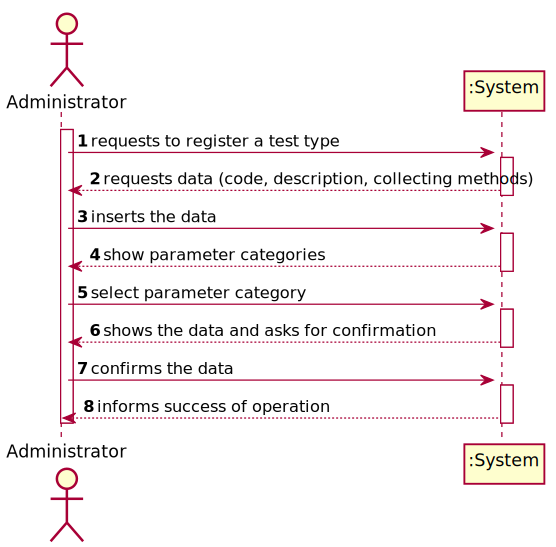
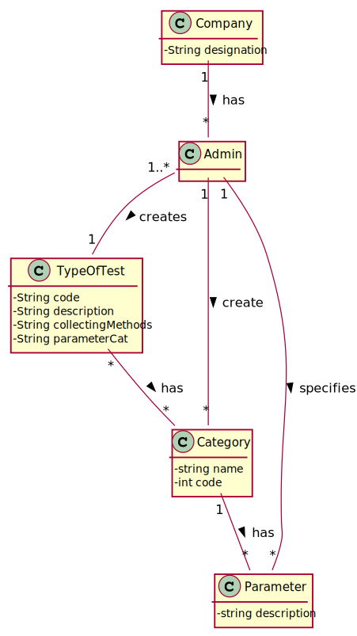
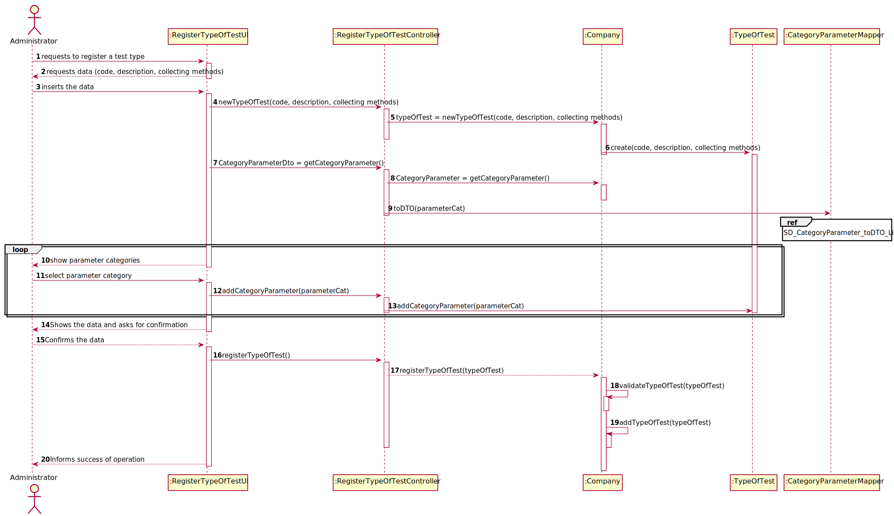
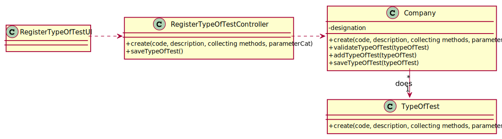

# US 009 - To create a new test type

## 1. Requirements Engineering

### 1.1. User Story Description

As an administrator, I want to specify a new type of test and its collecting methods.

### 1.2. Customer Specifications and Clarifications 

**From the specifications document:**

> Each type of test is characterized by a code, a description, 
> a collection method and a parameter category.

> The parameter categories are made up of certain parameters.

> Only the Administrator has the capability to create a new test type.

**From the client clarifications:**

> **Question:** What defines a test type category?
>  
> **Answer:** Each category has a name and a unique code. There are no subcategories.

> **Question:** Should the collection method be associated to the test type or to the sample type?
>  
> **Answer:** With the test type.
### 1.3. Acceptance Criteria

* **AC1:** Each user must have a single role defined in the system.
* **AC2:** The "auth" component available on the repository must be reused (without modifications).

### 1.4. Found out Dependencies

* There isn't dependencies.

### 1.5 Input and Output Data

**Input Data:**

* Typed data:
	* code
	* description
	* collectingMethods
	* parameterCat

**Output Data:**

* (In)Success of the operation

### 1.6. System Sequence Diagram (SSD)

**Other alternatives might exist**

### 1.7 Other Relevant Remarks

* The role is important to determine what data to ask to the user.

## 2. OO Analysis

### 2.1. Relevant Domain Model Excerpt 

### 2.2. Other Remarks

The TypeOfTest class is a class that in addition to the code, description
and collection method attributes category that you will receive from the
category class.

## 3. Design - User Story Realization 

### 3.1. Rationale

**SSD**

| Interaction ID | Question: Which class is responsible for... | Answer  | Justification (with patterns)  |
|:-------------  |:--------------------- |:------------|:---------------------------- |
| Step 1  		 |	... interacting with the actor? | CreateTaskUI   |  Pure Fabrication: there is no reason to assign this responsibility to any existing class in the Domain Model.           |
| 			  		 |	... coordinating the US? | CreateTaskController | Controller                             |
| 			  		 |	... instantiating a new Task? | Organization   | Creator (Rule 1): in the DM Organization has a Task.   |
| 			  		 | ... knowing the user using the system?  | UserSession  | IE: cf. A&A component documentation.  |
| 			  		 |	... knowing to which organization the user belongs to? | Platform  | IE: has registed all Organizations |
| 			  		 |							 | Organization   | IE: knows/has its own Employees|
| Step 2  		 |							 |             |                              |
| Step 3  		 |	...saving the inputted data? | Task  | IE: object created in step 1 has its own data.  |
| Step 4  		 |	...knowing the task categories to show? | Platform  | IE: Task Categories are defined by the Platform. |
| Step 5  		 |	... saving the selected category? | Task  | IE: object created in step 1 is classified in one Category.  |
| Step 6  		 |							 |             |                              |              
| Step 7  		 |	... validating all data (local validation)? | Task | IE: owns its data.| 
| 			  		 |	... validating all data (global validation)? | Organization | IE: knows all its tasks.| 
| 			  		 |	... saving the created task? | Organization | IE: owns all its tasks.| 
| Step 8  		 |	... informing operation success?| CreateTaskUI  | IE: is responsible for user interactions.  | 

### Systematization ##

According to the taken rationale, the conceptual classes promoted to software classes are: 

 * Company
 * BloodTest
 * CovidTest

Other software classes (i.e. Pure Fabrication) identified: 

 * RegisterEmployeeUI  
 * RegisterEmployeeController

## 3.2. Sequence Diagram (SD)

## 3.3. Class Diagram (CD)

# 4. Tests 

**Test 1:** TypeOfTestTest

	public class TypeOfTestTest {

    TypeOfTest typeOfTest = new TypeOfTest("1111", "sangue", "tubo");
    ParameterCategory parameterCategory = new ParameterCategory("abcde", "a");

    @Test
    public void getCode() {
        assertEquals(typeOfTest.getCode(),"1111");
    }

    @Test
    public void getDescription() {
        assertEquals(typeOfTest.getDescription(),"sangue");
    }

    @Test
    public void getCollectingMethods() {
        assertEquals(typeOfTest.getCollectingMethods(),"tubo");
    }

    @Test
    public void getParameterCategory() {
        typeOfTest.setParameterCategory(parameterCategory);
        assertEquals(typeOfTest.getParameterCategory(), parameterCategory);
    }

    @Test
    public void setCode() {
        typeOfTest.setCode("1111");
        assertEquals(typeOfTest.getCode(), "1111");
    }

    @Test
    public void setDescription() {
        typeOfTest.setDescription("sangue");
        assertEquals(typeOfTest.getDescription(), "sangue");
    }

    @Test
    public void setCollectingMethods() {
        typeOfTest.setCollectingMethods("tubo");
        assertEquals(typeOfTest.getCollectingMethods(), "tubo");
    }

    @Test
    public void setParameterCategory() {
        typeOfTest.setParameterCategory(parameterCategory);
        assertEquals(typeOfTest.getParameterCategory(), parameterCategory);
    }

}
	

**Test 2:** RegisterTypeOfTestControllerTest

	public class RegisterTypeOfTestControllerTest {

    Company company ;
    RegisterTypeOfTestController registerTypeOfTestController = new RegisterTypeOfTestController();
    TypeOfTest typeOfTest = new TypeOfTest("1111", "sangue", "tubo");

    @Test
    public void registerTypeOfTest() {
        assertTrue(registerTypeOfTestController.registerTypeOfTest("1111", "sangue", "tubo"));
    }

    @Test
    public void saveTypeOfTest() {
        registerTypeOfTestController.registerTypeOfTest("1111", "sangue", "tubo");
        assertTrue(registerTypeOfTestController.saveTypeOfTest(new TypeOfTest("1111", "sangue", "tubo"), "1234"));
    }

}

**Test 3:** CompanyTest

	@Test
    public void registerTypeOfTest() {
        assertEquals(company.registerTypeOfTest("1","teste1","teste2").toString(), tp1.toString());
    }

	@Test
    public void validateTypeOfTest() {
        assertTrue(company.validateTypeOfTest(tp1));
    }

    @Test
    public void saveTypeOfTest() {
        assertTrue(company.saveTypeOfTest(tp1));
    }

*It is also recommended to organize this content by subsections.* 

# 5. Construction (Implementation)

## Class RegisterTypeOfTestController 

	public class RegisterTypeOfTestController {

    	public Company company;
    		private TypeOfTest tt;
    		public RegisterTypeOfTestController() {
        		this(App.getInstance().getCompany());
    	}
    	public RegisterTypeOfTestController(Company company) {
        		this.company = company;
        		this.tt = null;
    	}

    	public boolean registerTypeOfTest(String code, String description, String collectingMethods) {
        		this.tt = this.company.registerTypeOfTest(code, description, collectingMethods);

        		return this.company.validateTypeOfTest(tt);
    	}

    	public boolean saveTypeOfTest(TypeOfTest tt, String code) {
        		tt.setParameterCategory(this.company.getCategory(code));
        		return this.company.saveTypeOfTest(tt);
    	}

    	public String showCategories(){
        		return company.getParameterCategoryList().toString();
    	}
	}

## Class TypeOfTest

	public class TypeOfTest {

    	private String code;
    	private String description;
    	private String collectingMethods;
    	private ParameterCategory parameterCategory;
    	public TypeOfTest(){
        		this.code=null;
        		this.description=null;
        		this.collectingMethods=null;
    	}

    	public TypeOfTest(String code, String description, String collectingMethods){
        		this.code=code;
        		this.description=description;
        		this.collectingMethods=collectingMethods;
    	}

    	public TypeOfTest(String code, String description, String collectingMethods, ParameterCategory parameterCategory){
        		this.code=code;
        		this.description=description;
        		this.collectingMethods=collectingMethods;
        		this.parameterCategory=parameterCategory;
    	}

    	public String getCode() {
			return code;
    	}

		public String getDescription() {
        		return description;
    	}

		public String getCollectingMethods() {
        		return collectingMethods;
    	}

    	public ParameterCategory getParameterCategory() {
        		return parameterCategory;
    	}

    	public void setCode(String code) {
        		this.code = code;
    	}

    	public void setDescription(String description) {
        		this.description = description;
    	}

    	public void setCollectingMethods(String collectingMethods) {
        		this.collectingMethods = collectingMethods;
    	}

    	public void setParameterCategory(ParameterCategory parameterCategory) {
        		this.parameterCategory = parameterCategory;
    	}

    	@Override
    	public String toString() {
        		return "TypeOfTest{" +
                	"code=" + code +
                	", description='" + description + '\'' +
                	", collectingMethods='" + collectingMethods + '\'' +
                	'}';
    	}
	}

# 6. Integration and Demo 

# 7. Observations

