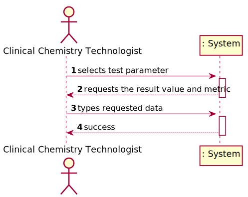
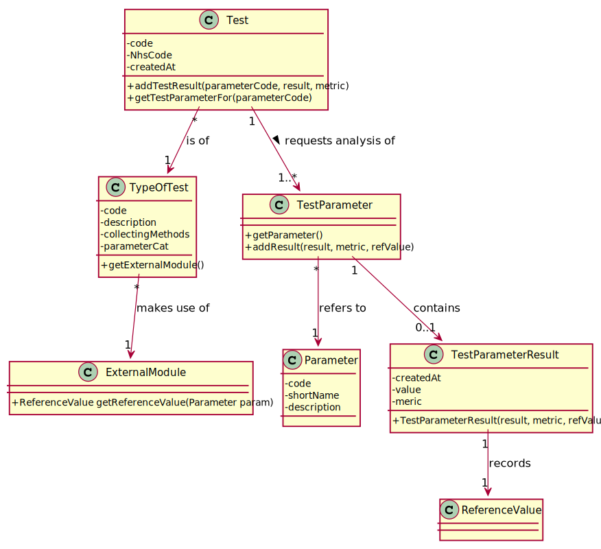
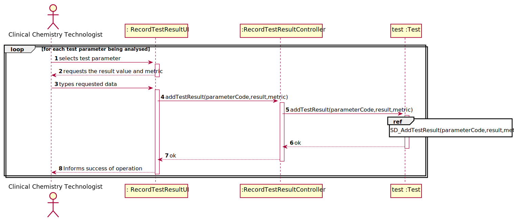
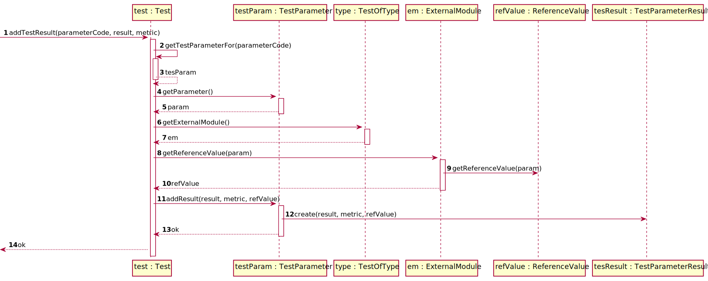
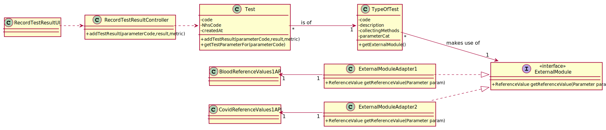

# US 012 - To record the results of a given test

## 1. Requirements Engineering

### 1.1. User Story Description

As a clinical chemistry technologist, I intend to record the results of a given test.

### 1.2. Customer Specifications and Clarifications

**From the specifications document:**

> "At the company's headquarters, the clinical chemistry technologist receives the samples (delivered
by a courier) and performs the chemical analysis, recording the results in the software application."

**From the client clarifications:**

> **Question:** What information is the system going to have to ask the clinical chemistry technologist to be able to create the test results?
>
> **Answer1:** The clinical chemistry technologist should use the sample barcode number to find (in the system) the test for which the sample was collected.
> **Answer2:** The Clinical Chemistry Technologist should register a value/result for each parameter of the (selected) test.
>
>(All parameter values of the test should be filled/defined (by the Clinical Chemistry Technologist) when the use case finishes.)

> **Question:** Does this "at most" express that there are some parameters of the API request that are optional? If so, could you clarify the parameters that are optional?
>
> **Answer:** "At most" means the maximum number of parameters that will be used. Depending on the API being used, all parameters above may be required or some may be optional.
>
> (Important: The number of parameters depends on the API that is being used.)

> **Question:** When the Clinical Chemistry Technologist wants to record the results of a test, how does he has access to that test? By internal code, NHS code?
>
> **Answer:**  Each sample has a unique barcode. The clinical chemistry technologist should use the sample barcode number to find the test for which the sample was collected.

> **Question:** Should the system present a result for each test parameter or a single result for the test to be recorded?
>
> **Answer:** The Clinical Chemistry Technologist should register a value/result for each parameter of the test.

> **Question:**  When you intend to record the results of the Blood Test, do you want to introduce all results for all parameters or just only one?
>
>  **Answer:** The clinical chemistry technologist should record all results related to a test at a given time/moment.

> **Question:** The results of the tests can be negative or there are any restriction in this particular variable?
>
> **Answer:** The result/value of one parameter is related with the type of parameter we are measuring. To get an idea, please check the values returned by the external modules (jar APIs).

### 1.3. Acceptance Criteria

* **AC1:** The application should use an external module that is responsible
  for providing the test reference values. The application can use an external module for
  each type of test. For instance, when the results are for blood tests parameters, the
  externalmodule BloodReferenceValues1API can be used. When the results are for
  Covid-19 tests parameters, the external module CovidReferenceValues1API can be used.
  In any case, the API request should include, at most: (i) a key to access the module (e.g.:
  “KEY1234”); (ii) a parameter identifier; (iii) the reference date; and (iv) reference
  measurement unit (e.g. "mg").

### 1.4. Found out Dependencies

* There is a dependency to the US09 and US04.

### 1.5 Input and Output Data

**Input Data:**

* Typed data:
    * code
    * description
    * collectingMethods
    * NhsCode
    * createdAt

**Output Data:**

* (In)Success of the operation

### 1.6. System Sequence Diagram (SSD)

**Other alternatives might exist**

### 1.7 Other Relevant Remarks

* The role is important to determine what data to ask to the user.

## 2. OO Analysis

### 2.1. Relevant Domain Model Excerpt

### 2.2. Other Remarks

The TypeOfTest class is a class that in addition to the code, description
and collection method attributes category that you will receive from the
category class.

## 3. Design - User Story Realization

### 3.1. Rationale

**SSD**

| Interaction ID | Question: Which class is responsible for... | Answer  | Justification (with patterns)  |
|:-------------  |:--------------------- |:------------|:---------------------------- |
|Step/Msg 1|RecordTestResultUI|selects test parameter |select test parameters |
|Msg 2|Clinical Chemistry Technologist|requests the result value and metric|requests the result value and metric|
|Msg 3|RecordTestResultUI|types requested data|types requested data|
|Msg 4|RecordTestResultController|addTestResult(parameterCode,result,metric)|add the test result|
|Msg 5|Test|addTestResult(parameterCode,result,metric)|add the test result|
|Msg 6|Test|getTestParameterFor(parameterCode)|asks for the parameter code|
|Msg 7|Test|tesParam|----------------//----------------|
|Msg 8|TestParameter|getParameter()|----------------//----------------|
|Msg 9|Test|param|----------------//----------------|
|Msg 10|TestOfType|getReferenceValue(param)|asks for the parameter|
|Msg 11|Test|em|----------------//----------------|
|Msg 12|ExternalModule|getReferenceValue(param)|asks for the parameter|
|Msg 13|ReferenceValue|getReferenceValue(param)|asks for the parameter|
|Msg 14|Test|refValue|----------------//----------------|
|Msg 15|TestParameter|addResult(result, metric, refValue)|add the test result|
|Msg 16|TestParameterResult|create(result, metric, refValue)|creates the report|
|Msg 17|Test|ok|confirm|
|Msg 18|RecordTestResultController|ok|confirm|
|Msg 19|RecordTestResultUI|ok|confirm|
|Msg 20|Clinical Chemistry Technologist|Informs success of operation|confirms and reports on the success of the operation|

### Systematization ##

According to the taken rationale, the conceptual classes promoted to software classes are:

* Test
* TestParameterResult

Other software classes (i.e. Pure Fabrication) identified:

* RecordTestResultUI
* RecordTestResulController

## 3.2. Sequence Diagram (SD)

## 3.2.1. Sequence Diagram (SD) : some details

## 3.3. Class Diagram (CD)

# 4. Tests

**Test 1:** Test

**Test 2:** RecordTestResultUI

**Test 3:** RecordTestResultController

*It is also recommended to organize this content by subsections.*

# 5. Construction (Implementation)

## Class RecordTestResultController

## Class Test

# 6. Integration and Demo

# 7. Observations

