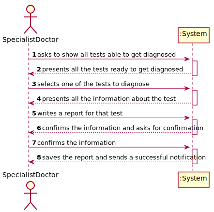
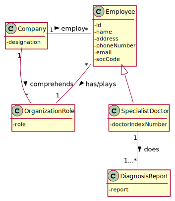
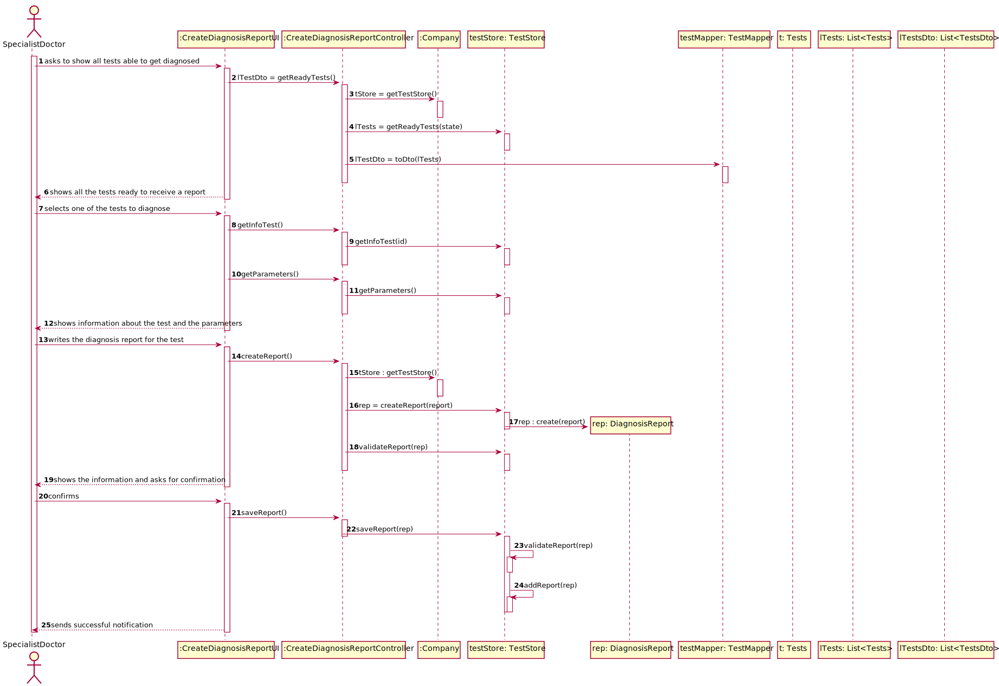
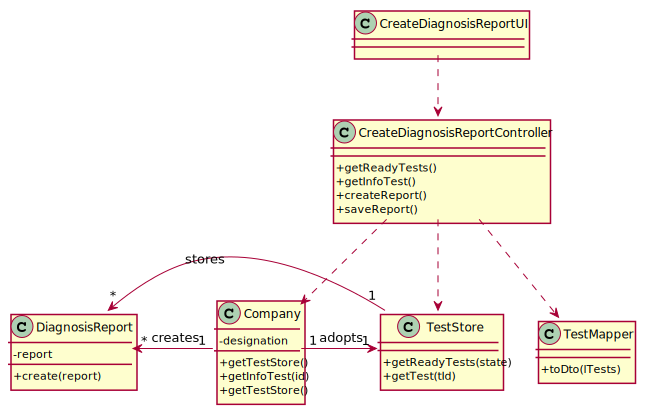

# US 14 - Diagnosis Report

## 1. Requirements Engineering

### 1.1. User Story Description

As a **specialist doctor**, I intend to make the diagnosis and write a report for a
given test.

### 1.2. Customer Specifications and Clarifications 

**From the specifications document:**

>After completing the chemical analysis, the results of all chemical analyses are analysed by a
specialist doctor who makes a diagnosis and writes a report that afterwards will be delivered to the
client.

>After the specialist doctor has completed the diagnosis, the results of the clinical analyses and the
report become available in the system and must be validated by the laboratory coordinator.

**From the client clarifications:**

>Q: What characterizes a diagnosis? What it needs to have in it to be a valid diagnosis?

>A: The report contains the diagnosis. The report is free text and should have no more than 400 words.

---------------------------------------------

>Q: Regarding the tests that the Specialist Doctor can write a report about. Should the SD chose from a list of tests?
> and Should him only receive a list of test that have completed all the previous steps?

>A: The system shows all tests ready (that have completed all the previous steps) to make the diagnosis and the 
> Specialist Doctor selects one test. Then, the Specialist Doctor writes the report for the selected test.

--------------------------------------------

>Q: If the report is not validated by the Lab Coordinator, can it be due to the report and diagnosis or are all of the 
> reports and diagnosis written valid?

>A: I already answered this question.

--------------------------------------------

>Q: Can the Specialist Doctor edit a report once it has already been written? If yes, in what occasion should he be 
> able to edit? Can he edit after the Laboratory Coordinator has already approved the report?

>A: No. No.

--------------------------------------------
>Q: Once the specialist doctor decides to write the report for a given test, should the results of the chemical analysis
> and the reference values be presented on the screen? If not, how should the specialist doctor access the data related 
> to the diagnosis he needs to make?

>A: After selecting a test (to make the diagnosis/report) the results of the chemical analysis and the reference values
> should be presented on the screen. Then the Specialist Doctor should write the report.

>Q: While in the "Make a diagnosis and write a report" option of the main menu, should the specialist doctor be able to 
> make a diagnosis and write a report for more than one test? Or does he need to exit and enter the "Make a diagnosis 
> and write a report" option every time he wants to make a new diagnosis and write a new report?

>A: After writing a report the SD can choose to write other reports without leaving the use case.

### 1.3. Acceptance Criteria

* **AC1:** The specialist doctor is only able to choose a test when this has completed all the previous steps to be 
  ready.
  
* **AC2** The Specialist doctor after writing the report and being validated by the Laboratory Coordinator,
  the report cannot be edited.
  
* **AC3** The report written by the Specialist Doctor is free text and should have no more than 400 words.
  
### 1.4. Found out Dependencies

There is a dependency to the [US04](../US04) [US05](../US05) 
[US07](C:\Users\saol0\Documents\lei-21-s2-1do-g64\docs\SprintB\US7) [US12](../US12) because the Specialist Doctor can 
only do a report if the results of the given test had been recorded on the system.

### 1.5 Input and Output Data

**Input Data:**

* Typed data:
    * a report

* Selected data:
    * the test ready to receive a report
      
**Output Data:**

* Diagnosis report

### 1.6. System Sequence Diagram (SSD)

## 2. OO Analysis

### 2.1. Relevant Domain Model Excerpt 

## 3. Design - User Story Realization

### 3.1. Rationale

| Interaction ID | Question: Which class is responsible for... | Answer  | Justification (with patterns)  |
|:-------------  |:--------------------- |:------------|:---------------------------- |
|Step/Msg 1|CreateDiagnosisReportUI|asks to show tests ready to get diagnosed | needs to choose a test to diagnose and write a report |
|Msg 2|CreateDiagnosisReportController|getReadyTests()|needs to get a list of ready tests|
|Msg 3|Company|getTestStore()|needs access on the test store|
|Msg 4|TestStore|getReadyTests()|gets all ready tests|
|Msg 5|TestMapper|toDto()||
|Msg 6|Specialist Doctor|shows all the tests ready to receive a report||
|Msg 7|CreateDiagnosisReportUI|selects one of the tests to diagnose|selects a test to diagnose|
|Msg 8|CreateDiagnosisReportController|getInfoTest()|gets the test results|
|Msg 9|Company|getInfoTest()|gets the test data|
|Msg 10|CreateDiagnosisReportUI|getParameters()|gets the parameters to compare with the test results|
|Msg 11|CreateDiagnosisReportController|getParameters()||
|Msg 12|Specialist Doctor|shows information about the test and the parameters||
|Msg 13|CreateDiagnosisReportUI|writes the diagnosis report for the test||
|Msg 14|CreateDiagnosisReportController|createReport()|needs to create the report|
|Msg 15|Company|getTestStore()||
|Msg 16|TestStore|createReport()||
|Msg 17|Report|create(report)|creates a report|
|Msg 18|TestStore|validateReport()||
|Msg 19|Specialist Doctor|shows the information and asks for confirmation||
|Msg 20|CreateDiagnosisReportUI|confirms||
|Msg 21|CreateDiagnosisReportController|saveReport()|saves the report|
|Msg 22|TestStore|saveReport(rep)||
|Msg 23|TestStore|validateReport(rep)||
|Msg 24|TestStore|addReport(rep)||

### Systematization ##

According to the taken rationale, the conceptual classes promoted to software classes are: 

 * Company
 * SpecialistDoctor

Other software classes (i.e. Pure Fabrication) identified: 
 * CreateDiagnosisReportUI
 * CreateDiagnosisReportController

## 3.2. Sequence Diagram (SD)

## 3.3. Class Diagram (CD)

# 4. Tests

# 5. Construction (Implementation)

# 6. Integration and Demo 

# 7. Observations

