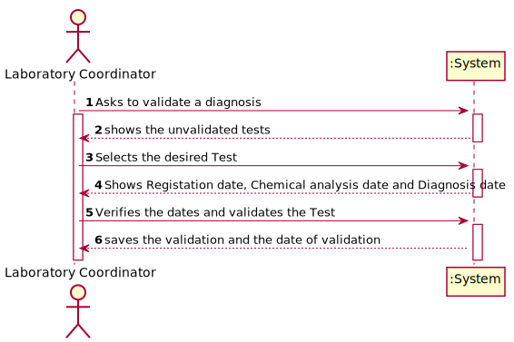
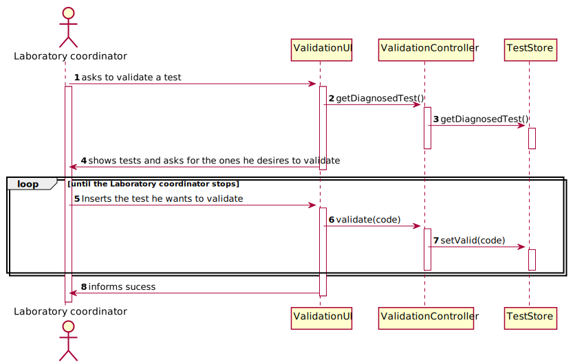

# US 15 - Diagnosis Validation

## 1. Requirements Engineering

*In this section, it is suggested to capture the requirement description and specifications as provided by the client as well as any further clarification on it. It is also suggested to capture the requirements acceptance criteria and existing dependencies to other requirements. At last, identfy the involved input and output data and depicted an Actor-System interaction in order to fulfill the requirement.*

### 1.1. User Story Description

As a **laboratory coordinator**, I want to validate the work done by the clinical chemistry
technologist and specialist doctor.

### 1.2. Customer Specifications and Clarifications 

*Insert here any related specification and/or clarification provided by the client together with **your interpretation**. When possible, provide a link to such specifications/clarifications.*

**From the client clarifications:**

### 1.3. Acceptance Criteria

* **AC1:** The system does not show client personal information but
  shows all dates (test registration date, chemical analysis date and diagnosis date).
### 1.4. Found out Dependencies

There is a dependencie to the [US14](../US14), 
[US12](../US12), [US5](../US5), [US4](../US4)
### 1.5 Input and Output Data

**Input Data:**

* Typed data:
    * a validation

* Selected data:
    * The Test we wants to validate
      
**Output Data:**

* Test registration date
* Chemical analysis date
* Diagnosis date

### 1.6. System Sequence Diagram (SSD)

### 1.7 Other Relevant Remarks

n/a

## 2. OO Analysis

### 2.1. Relevant Domain Model Excerpt 

### 2.2. Other Remarks

n/a

## 3. Design - User Story Realization 

### 3.1. Rationale

### Systematization ##

According to the taken rationale, the conceptual classes promoted to software classes are: 

 * TestStore

Other software classes (i.e. Pure Fabrication) identified: 
 * ValidationUI
 * ValidationController

## 3.2. Sequence Diagram (SD)

## 3.3. Class Diagram (CD)

# 4. Tests

**Test 1:** Check that it is not possible to create an instance of the Parameter class with null values.

	@Test(expected = IllegalArgumentException.class)
		public void ensureNullIsNotAllowed() {
		Parameter instance = new PArameter(null, null, null, null, null, null, null);
	}
**Test 2:** Check that it is not possible to create an instance of the Parameters class with a code containing less than five chars - AC2.

	@Test(expected = IllegalArgumentException.class)
		public void ensureReferenceMeetsAC2() {
		ParameterCategory cat = new ParameterCategory(10000, "Category 10", null);
		
		Parameter instance = new Parameter("1111", "BFD", "description",cat);
	}

*It is also recommended to organize this content by subsections.* 

# 5. Construction (Implementation)

*In this section, it is suggested to provide, if necessary, some evidence that the construction/implementation is in accordance with the previously carried out design. Furthermore, it is recommeded to mention/describe the existence of other relevant (e.g. configuration) files and highlight relevant commits.*

*It is also recommended to organize this content by subsections.* 

# 6. Integration and Demo 

*In this section, it is suggested to describe the efforts made to integrate this functionality with the other features of the system.*

# 7. Observations

*In this section, it is suggested to present a critical perspective on the developed work, pointing, for example, to other alternatives and or future related work.*

