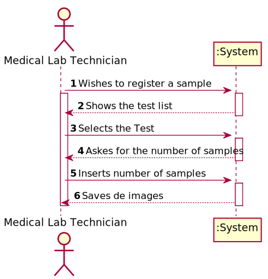
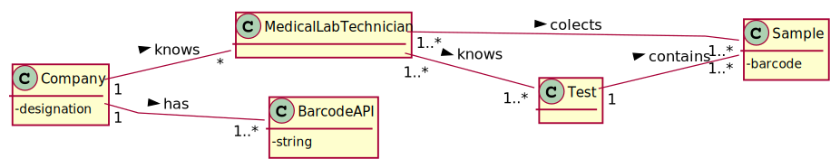
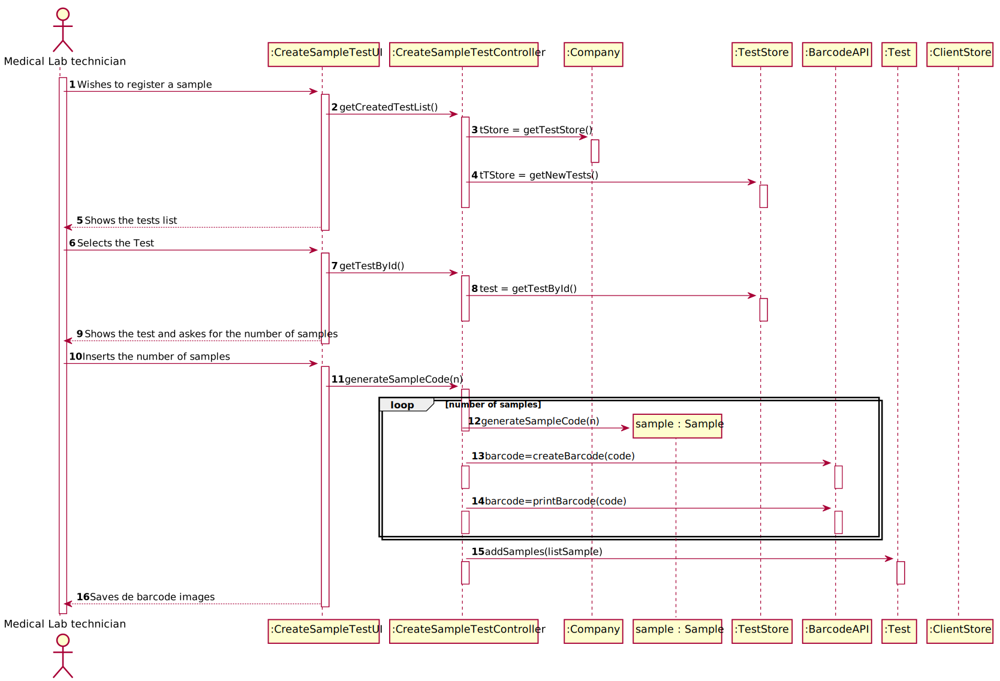
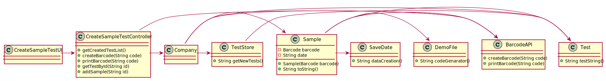

# US 08 - To register a new clinical analysis laboratory

## 1. Requirements Engineering

*In this section, it is suggested to capture the requirement description and specifications as provided by the client as well as any further clarification on it. It is also suggested to capture the requirements acceptance criteria and existing dependencies to other requirements. At last, identfy the involved input and output data and depicted an Actor-System interaction in order to fulfill the requirement.*

### 1.1. User Story Description

*As a medical lab technician,  I want to record the samples collected  in the scope of a given test.*

### 1.2. Customer Specifications and Clarifications 

**From the specifications document:**

>	Only the Administrator has the capability to register a new clinical analysis laboratory.

**From the client clarifications:**

> **Question:** What information does the medical lab technician needs to input to record a new sample?
>
> **Answer:** The medical lab technician checks a list of tests and selects one. Then, the application
generates barcodes (one or more). After printing the barcodes (one or more) the use case ends.
In my opinion, from the Project Description, rom the requirements of Sprint C and from my previous
answers in this forum, you should already have noticed this flow.

> **Question:** What kind of attributes should a sample have?
>
> **Answer:** Each sample is associated with a test. A sample has only one attribute, a barcode number (UPC) that
is a sequential number and is automatically generated by the system. Each sample has a unique barcode number.

> **Question:** Can a test have more than one sample?
>
> **Answer:** Yes.

> **Question:** We didn't fully understand what will the API do in this US, so here's out interpretation from the US, correct
us if we're wrong please: The API will be generated randomly and the API is an attribute from the sample.
>
> **Answer:** The API will be used to generate/print barcodes.

> **Question:** In the US acceptance criteria, it's also said that: "The API to use is defined by configuration.", does this
means the medical lab technician is the one who chooses which kind of API wants to use for a certain sample?
>
> **Answer:** No. You should study ESOFT to answer this question.

> **Question:**  During the current sprint, how should we allow the barcodes to be printed.
After generating them via the API, should we save the barcode images to the disk?
>
> **Answer:** Each generated barcode should be saved in a folder as a jpeg file.

> **Question:** It was answered in one of the previous questions that the sample only has one attribute, the barcode, however the
description of the project also mentions a date of collection of the samples, is this date supposed to be an attribute
of the test and not of the sample itself?
>
> **Answer:** Yes. The system should record the date (DD/MM/YYYY) and time (HH:MM) when the sample is collect made. The date and
time are automatically generated by the system when the barcode is issued.

> **Question:** If there were multiple samples for a single test, would there be only one collection date for all of them?
>
> **Answer:** Only one collection date and time for a test.

> **Question:** Shouldn't there be a way for technicians to add more samples to an existing test?
>
> **Answer:** No.

> **Question:** Should there be a validation of the number of samples?
>
> **Answer:** No.

> **Question:** After the barcodes are generated. The concept-reality link would be, for example to stick each barcode into each sample?
>
> **Answer:** Yes. Each generated barcode should be saved in a folder as a jpeg file.

> **Question:** What information does the medical lab technician needs to input to record a new sample?
>
> **Answer:** The medical lab technician checks a list of tests and selects one. Then, the application generates barcodes (one or more).
After printing the barcodes (one or more) the use case ends.
In my opinion, from the Project Description, rom the requirements of Sprint C and from my previous answers in this forum, you
should already have noticed this flow.

> **Question:** What kind of attributes should a sample have?
>
> **Answer:** Each sample is associated with a test. A sample has only one attribute, a barcode number (UPC) that is a sequential number and is
automatically generated by the system. Each sample has a unique barcode number.

> **Question:** Can a test have more than one sample?
>
> **Answer:** Yes.

### 1.3. Acceptance Criteria

*The system should support several barcode APIs. The API to use is defined by configuration.*

### 1.4. Found out Dependencies

*There is a dependency to the [US3](../US3) because the Medical Lab Technician can only record the sample collected if 
the test is created.*

### 1.5 Input and Output Data

#### Input

####Output
>*Saves de barcode images*

### 1.6. System Sequence Diagram (SSD)

### 1.7 Other Relevant Remarks

* The Medical Lab Technician chooses de test from the list and chosses howmany samples to generate.

## 2. OO Analysis

### 2.1. Relevant Domain Model Excerpt 
*In this section, it is suggested to present an excerpt of the domain model that is seen as relevant to fulfill this requirement.* 

### 2.2. Other Remarks

*Use this section to capture some aditional notes/remarks that must be taken into consideration into the design activity. In some case, it might be usefull to add other analysis artifacts (e.g. activity or state diagrams).* 

## 3. Design - User Story Realization 

### 3.1. Rationale

**The rationale grounds on the SSD interactions and the identified input/output data.**

| Interaction ID | Question: Which class is responsible for... | Answer  | Justification (with patterns)  |
|:-------------  |:--------------------- |:------------|:---------------------------- |
| Step 1  		 |	Wishes to register a sample | CreateSampleTestUI   |  Pure Fabrication: there is no reason to assign this responsibility to any existing class in the Domain Model.           |                              |
| Step 6         |  Tests that he wants to choose| List of Tests|   |
| Step 10        |  Inserts the number of samples| generate the Samples Barcodes| | 

### Systematization ##

According to the taken rationale, the conceptual classes promoted to software classes are: 

 * Company
 * Test
 * BarcodeAPI
 * Sample
 * TestStore
 * ClientStore
 * DemoFile
 * SaveDate

Other software classes (i.e. Pure Fabrication) identified: 
 * CreateSampleTestUI  
 * CreateSampleTestController

## 3.2. Sequence Diagram (SD)

*In this section, it is suggested to present an UML dynamic view stating the sequence of domain related software objects' interactions that allows to fulfill the requirement.* 

## 3.3. Class Diagram (CD)

*In this section, it is suggested to present an UML static view representing the main domain related software classes that are involved in fulfilling the requirement as well as and their relations, attributes and methods.*

# 4. Tests 
*In this section, it is suggested to systematize how the tests were designed to allow a correct measurement of requirements fulfilling.* 

**_DO NOT COPY ALL DEVELOPED TESTS HERE_**

**Test 1:** Check that it is not possible to create an instance of the Example class with null values. 

	@Test(expected = IllegalArgumentException.class)
		public void ensureNullIsNotAllowed() {
		Exemplo instance = new Exemplo(null, null);
	}

*It is also recommended to organize this content by subsections.* 

# 5. Construction (Implementation)

*In this section, it is suggested to provide, if necessary, some evidence that the construction/implementation is in accordance with the previously carried out design. Furthermore, it is recommeded to mention/describe the existence of other relevant (e.g. configuration) files and highlight relevant commits.*

*It is also recommended to organize this content by subsections.* 

# 6. Integration and Demo 

*In this section, it is suggested to describe the efforts made to integrate this functionality with the other features of the system.*

# 7. Observations

*In this section, it is suggested to present a critical perspective on the developed work, pointing, for example, to other alternatives and or future related work.*

