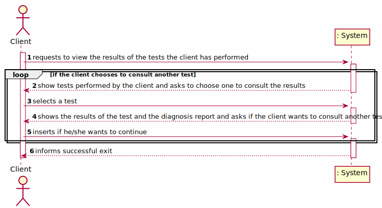
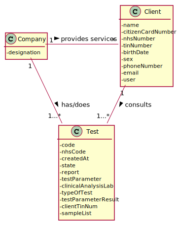
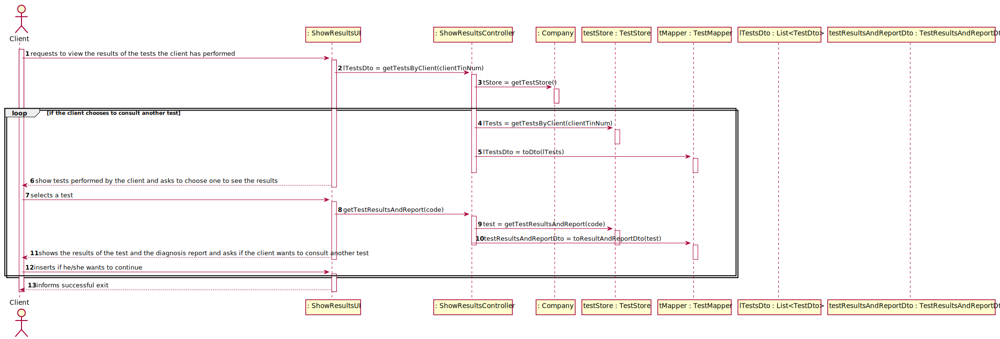
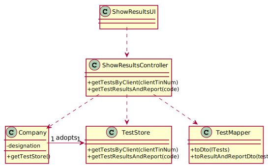

# US 001 - View the results of the tests the client have performed

## 1. Requirements Engineering

### 1.1. User Story Description

As a client, I want to access the application to view the results of the tests I have
performed.

### 1.2. Customer Specifications and Clarifications

**From the client clarifications:**

> **Question:** What are the data to show the customer? and in what way do we have to show? do you have any examples you can give us?
>  
> **Answer:** I want to access the application to view the results of the tests I have performed. This includes the report made by the specialist doctor.
The client tests must be shown ordered from the most recent to the oldest one. The test results are shown only after the client has selected a test.

----------------------------------------------

> **Question:** In US01 which date should be used to arrange the tests in order?The date the test is done or the validation date?
>
> **Answer:** The test registration date.

### 1.3. Acceptance Criteria

* **AC1:** The client tests must be shown ordered from the most
  recent to the oldest one. The test results are shown only after the client has
  selected a test.

### 1.4. Found out Dependencies

* There isn't dependencies.

### 1.5 Input and Output Data

**Input Data:**

* Typed data:
	* the code of the test the client wants to consult

**Output Data:**

* The list of tests the client has performed.
* The results of the test and the diagnosis report the client wants to consult

### 1.6. System Sequence Diagram (SSD)

**Other alternatives might exist**

### 1.7 Other Relevant Remarks

* It's necessary a loop to make sure that the client consults all the tests he wants that he/she has performed

## 2. OO Analysis

### 2.1. Relevant Domain Model Excerpt 

### 2.2. Other Remarks

* Nothing to remark.

## 3. Design - User Story Realization 

### 3.1. Rationale

| Interaction ID | Question: Which class is responsible for... | Answer  | Justification (with patterns)  |
|:-------------  |:--------------------- |:------------|:---------------------------- |
|Step/Msg 1|ShowResultsUI|requests to view the results of the tests the client has performed | needs to consult the results of the tests the client has performed |
|Msg 2|ShowResultsController|getTestsByClient(clientTinNum)|needs to get a list of tests of the client|
|Msg 3|Company |getTestStore()|needs to ask to the company for the TestStore|
|Msg 4|TestStore |getTestsByClient(clientTinNum)|needs to get a list of tests of the client|
|Msg 5|TestMapper | toDto(lTests)||
|Msg 6|Client| show tests performed by the client and asks to choose one to see the results||
|Msg 7|ShowResultsUI | selects a test||
|Msg 8| ShowResultsController| getTestResultsAndReport(code)|need to get the results and the report of the test|
|Msg 9|TestStore | getTestResultsAndReport(code)||
|Msg 10|TestMapper | toResultAndReportDto(test)||
|Msg 11|Client | shows the results of the test and the diagnosis report and asks if the client wants to consult another test||

### Systematization ##

According to the taken rationale, the conceptual classes promoted to software classes are: 

 * Company

Other software classes (i.e. Pure Fabrication) identified: 

 * ShowResultsUI
 * ShowResultsController
 * TestStore
 * TestMapper 
 * TestResultsAndReportDto
 * List<TestDto>

## 3.2. Sequence Diagram (SD)

## 3.3. Class Diagram (CD)

# 4. Tests 

**Test 1:** Check that it is not possible to create an instance of the Task class with null values. 

	@Test(expected = IllegalArgumentException.class)
		public void ensureNullIsNotAllowed() {
		Task instance = new Task(null, null, null, null, null, null, null);
	}
	

**Test 2:** Check that it is not possible to create an instance of the Task class with a reference containing less than five chars - AC2. 

	@Test(expected = IllegalArgumentException.class)
		public void ensureReferenceMeetsAC2() {
		Category cat = new Category(10, "Category 10");
		
		Task instance = new Task("Ab1", "Task Description", "Informal Data", "Technical Data", 3, 3780, cat);
	}

*It is also recommended to organize this content by subsections.* 

# 5. Construction (Implementation)

## Class CreateTaskController 

		public boolean createTask(String ref, String designation, String informalDesc, 
			String technicalDesc, Integer duration, Double cost, Integer catId)() {
		
			Category cat = this.platform.getCategoryById(catId);
			
			Organization org;
			// ... (omitted)
			
			this.task = org.createTask(ref, designation, informalDesc, technicalDesc, duration, cost, cat);
			
			return (this.task != null);
		}

## Class Organization

		public Task createTask(String ref, String designation, String informalDesc, 
			String technicalDesc, Integer duration, Double cost, Category cat)() {
		
	
			Task task = new Task(ref, designation, informalDesc, technicalDesc, duration, cost, cat);
			if (this.validateTask(task))
				return task;
			return null;
		}

# 6. Integration and Demo 

# 7. Observations

