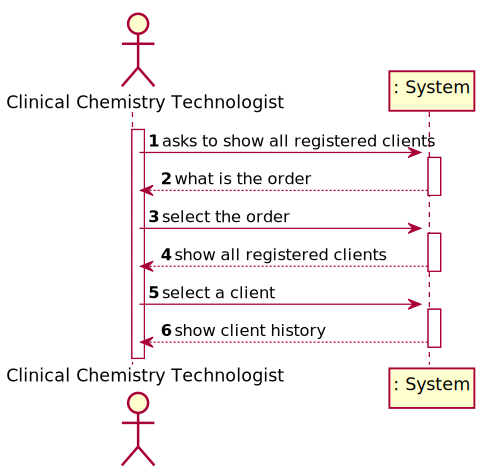
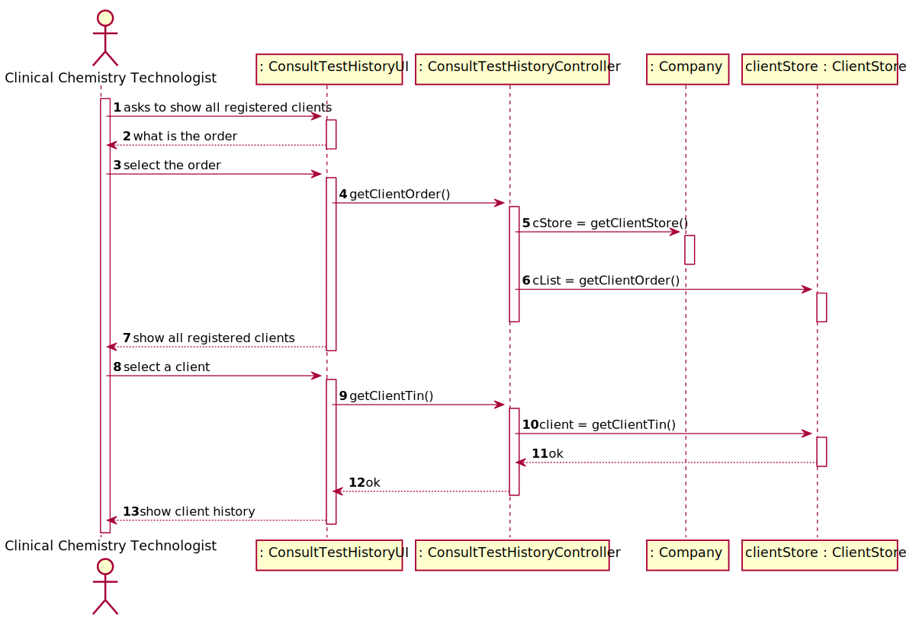

# US 013 - To consult the historical tests performed by a particular client and to be able to check tests details/results

## 1. Requirements Engineering

### 1.1. User Story Description

As a clinical chemistry technologist, I intend to consult the historical tests
performed by a particular client and to be able to check tests details/results.

### 1.2. Customer Specifications and Clarifications

**From the specifications document:**

> "To facilitate the access to the results, the application must allow ordering the clients by TIF and by
name. The ordering algorithm to be used by the application must be defined through a configuration
file. It is intended that the choice of the ordering algorithm is based on the algorithm complexity
(mainly the execution time)."

**From the client clarifications:**

> **Question:**  Should we show every client already registered when we show the clients' list to the clinical chemistry technologist or should we only show the clients' with a test or more already assigned?
>
> **Answer:** The system should show only clients that have tests already validated by the lab coordinator.

> **Question:** From the user story description "As a clinical chemistry technologist, I intend to consult the historical tests performed by a particular client and to be able to check tests details/results". What do you mean by "check tests details/results" ?
> 
> **Answer:**  The clinical chemistry technologist should be able to check the historical tests performed by a particular client and see the results obtained in each test. For a given client (that was selected by the clinical chemistry technologist) the application should show all tests performed by the client and, for each parameter, the application should show the parameter value and the parameter reference values. The clinical chemistry technologist should not have access to the report made by the specialist doctor.

> **Question:** The client's tests, that we have to show on this US, need to have been validated by the lab coordinator or is it enough if they just have results and we can show them before being validated by the lab coordinator?
> 
> **Answer:** The tests to be presented in US13 are tests that have already been validated by the lab coordinator.

### 1.3. Acceptance Criteria

* **AC1:** The application must allow ordering the clients by TIN and
  by name to help the clinical chemistry technologist choose the target client. The
  ordering algorithm to be used by the application must be defined through a
  configuration file. At least two sorting algorithms should be available.

### 1.4. Found out Dependencies

* There is a dependency to the US04, US09 and US12.

### 1.5 Input and Output Data

**Input Data:**

* Typed data:
    * tin
    * name

**Output Data:**

* (In)Success of the operation

### 1.6. System Sequence Diagram (SSD)

**Other alternatives might exist**

### 1.7 Other Relevant Remarks

* The role is important to determine what data to ask to the user.

## 2. OO Analysis

### 2.1. Relevant Domain Model Excerpt

### 2.2. Other Remarks

## 3. Design - User Story Realization

### 3.1. Rationale

**SSD**

| Interaction ID | Question: Which class is responsible for... | Answer  | Justification (with patterns)  |
|:-------------  |:--------------------- |:------------|:---------------------------- |
|Step/Msg 1|ConsultTestHistoryUI|asks to show all registered clients|asks to show all registered clients|
|Step/Msg 2|Clinical Chemistry Technologist|what is the order|asks why the order wants to see a list of customers|
|Step/Msg 3|ConsultTestHistoryUI|select the order|select the order|
|Step/Msg 4|ConsultTestHistoryController|getClientOrder()|get ordered list of clients|
|Step/Msg 5|Company|cStore = getClientStore()|get ordered list of clients|
|Step/Msg 6|ClientStore|cList = getClientOrder()|get ordered list of clients|
|Step/Msg 7|Clinical Chemistry Technologist|show all registered clients|show all registered clients|
|Step/Msg 8|ConsultTestHistoryUI|select a client|select a client|
|Step/Msg 9|ConsultTestHistoryController|getClientTin()|get the client by tin|
|Step/Msg 10|ClientStore|client = getClientTin()|get the client by tin|
|Step/Msg 11|ConsultTestHistoryController|ok|----------------//----------------|
|Step/Msg 12|ConsultTestHistoryUI|ok|----------------//----------------|
|Step/Msg 13|Clinical Chemistry Technologist|show client history|show client history|

### Systematization ##

According to the taken rationale, the conceptual classes promoted to software classes are:

*Client
*ClientStore
*Test
*TestStore

Other software classes (i.e. Pure Fabrication) identified:

* ConsultTestHistoryUI
* ConsultTestHistoryController

## 3.2. Sequence Diagram (SD)

## 3.3. Class Diagram (CD)

# 4. Tests

**Test 1:** Test

**Test 2:** ConsultTestHistoryUI

**Test 3:** ConsultTestHistoryController

*It is also recommended to organize this content by subsections.*

# 5. Construction (Implementation)

## Class ConsultTestHistoryController

## Class Test

# 6. Integration and Demo

# 7. Observations

