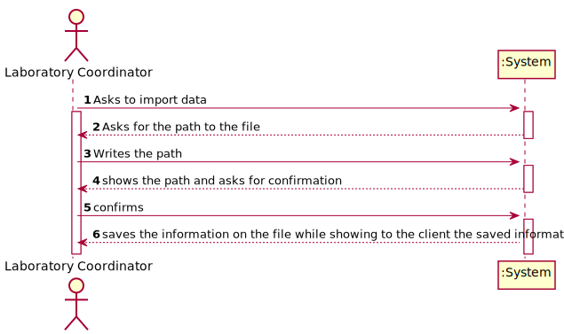
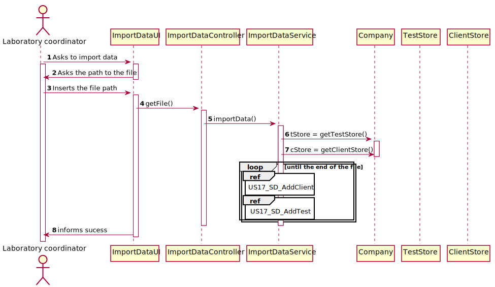
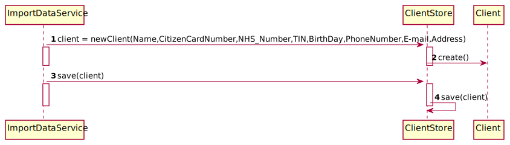

# US 17 - Import data from a CVS file

## 1. Requirements Engineering

### 1.1. User Story Description

As a **laboratory coordinator**, I want to import clinical tests from a CSV file .

### 1.2. Customer Specifications and Clarifications 

*Insert here any related specification and/or clarification provided by the client together with **your interpretation**. When possible, provide a link to such specifications/clarifications.*

**From the specifications document:**

> The **laboratory coordinator** selects a CSV file and the application reads and saves the data

**From the client clarifications:**

>**Question 1**: If some kind of data is wrong, what should happen should we just ignore the line where it is located?
> 
> **Answer 1** :If some kind of data is wrong, what should happen should we just ignore the line where it is located
A: The application should not load tests that have incorrect attribute values. The application should identify the tests that have incorrect values and it should continue loading all valid tests that exist in the file. A message should be sent to the console to identify the tests/lines that have incorrect values.
> 
> **Question 2**: Should we show the data that the laboratory coordinator is importing?
> 
> **Answer 2** :  Yes, it should show all the data that was imported at that time.
> 
> **Question 3** : If a labID on the CSV file isn't found on the system, should we consider it "invalid data"?
> 
> **Answer 3** : To import tests of any laboratory (with a given Lab_ID), it is required that a laboratory having the given Lab_ID exists in the system.
Therefore, if you want to import data from a given laboratory, you should use the application to create that laboratory in the system. Then you should import the data.
>When creating a laboratory in the system, you should use the given Lab_ID (available in the CSV file) and define the other attributes using valid data. In this project, we are NOT going to import data from laboratories (or other entities) to reduce the amount of hours required to develop and deliver a working application to the client.
>What I say in this message is valid for the laboratories and for other entities that appear in the CSV files.
>
>  **Question 4** : The format of the attributes of one category are:
Name: is a string with no more than 10 characters;
Code: are five alphanumeric characters. The code is unique and is not automatically generated.
Both attributes are mandatory.
There are no subcategories.
> 
> **Answer 4** : Please modify your application to accept category names with a maximum of 15 characters.

### 1.3. Acceptance Criteria

* **AC1:** If the file contains invalid data (e.g., a parameter not
  defined in the system), that data should not be load into the system. An exception
  should be thrown
  
### 1.4. Found out Dependencies

There is a dependencie to the [US12](../../SprintC/US12), 
[US3](../../SprintB/US3), [US4](../../SprintB/US4)
### 1.5 Input and Output Data

**Input Data:**

* Typed data:
    * the path for the CVS File
    
**Output Data:**

* Data in the cvs file

### 1.6. System Sequence Diagram (SSD)

### 1.7 Other Relevant Remarks

n/a

## 2. OO Analysis

### 2.1. Relevant Domain Model Excerpt 

### 2.2. Other Remarks

n/a

## 3. Design - User Story Realization 

### 3.1. Rationale

### Systematization ##

According to the taken rationale, the conceptual classes promoted to software classes are: 

 * Company
*TypeTest
   *Test
   *ParameterCategory
   *TestParameterResults

Other software classes (i.e. Pure Fabrication) identified: 
 * ImportDataUI
 * ImportDataController
* TestStore
  *ClientStore
* ImportDataService

## 3.2. Sequence Diagram (SD)

* US17_SD_AddClient

* US17_SD_AddTest

## 3.3. Class Diagram (CD)

# 4. Tests

**Test 1:** Check that it is not possible to create an instance of the Parameter class with null values.

	@Test(expected = IllegalArgumentException.class)
		public void ensureNullIsNotAllowed() {
		Parameter instance = new PArameter(null, null, null, null, null, null, null);
	}
**Test 2:** Check that it is not possible to create an instance of the Parameters class with a code containing less than five chars - AC2.

	@Test(expected = IllegalArgumentException.class)
		public void ensureReferenceMeetsAC2() {
		ParameterCategory cat = new ParameterCategory(10000, "Category 10", null);
		
		Parameter instance = new Parameter("1111", "BFD", "description",cat);
	}

*It is also recommended to organize this content by subsections.* 

# 5. Construction (Implementation)

*In this section, it is suggested to provide, if necessary, some evidence that the construction/implementation is in accordance with the previously carried out design. Furthermore, it is recommeded to mention/describe the existence of other relevant (e.g. configuration) files and highlight relevant commits.*

*It is also recommended to organize this content by subsections.* 

# 6. Integration and Demo 

*In this section, it is suggested to describe the efforts made to integrate this functionality with the other features of the system.*

# 7. Observations

*In this section, it is suggested to present a critical perspective on the developed work, pointing, for example, to other alternatives and or future related work.*

