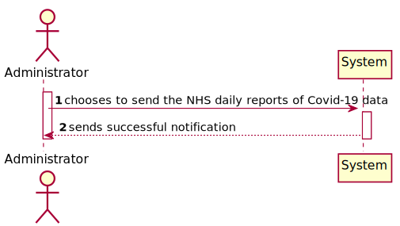
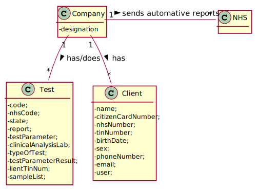
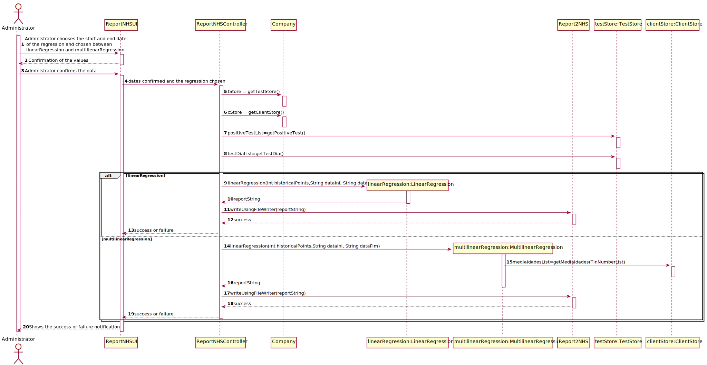
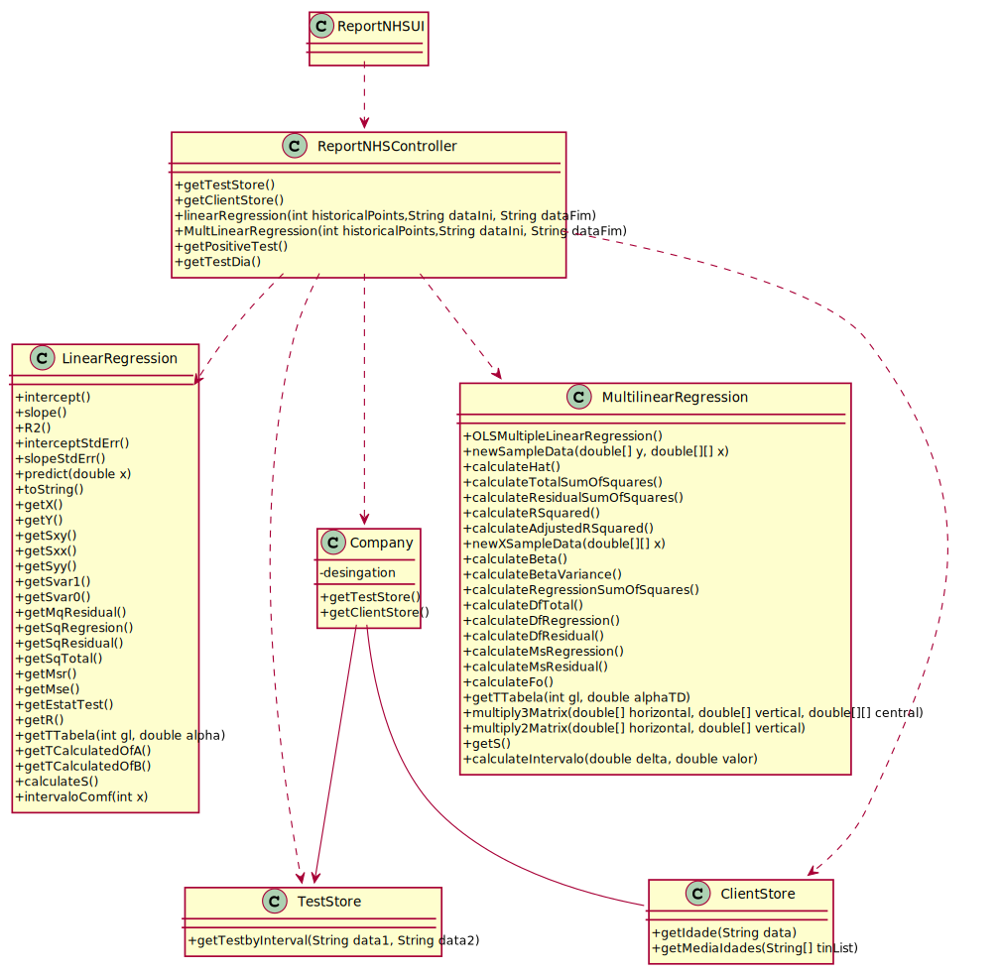

# US 018 - Send the NHS daily Reports

## 1. Requirements Engineering

### 1.1. User Story Description

As an Administrator  I want to send the Covid-19 report to the NHS at any time. I want to define the interval  
of dates to fit the regression model, the number of historical points (number of daysor number ofweeks) that must be 
sent to the NHS, the regression modelto use and selectthe independent variables  to use.

### 1.2. Customer Specifications and Clarifications

**From the client clarifications:**

> **Question:** I would like to know if will be given a Multiple Linear Regression Class to work, or should it be
developed by the groups?
>  
> **Answer:**  The Multiple Linear Regression Class should be developed by each team. In moodle I made available
a Java file with Simple Linear Regression.
The teams should not use libraries or other external modules to implement linear regression.

----------------------------------------------

> **Question:** Regarding US18 and US19, it is only one report containing all the tests performed by Many Labs to
be sent each time, correct? Or is it one report per laboratory, for example? Or other option?
>
> **Answer:** The report should contain all the tests made by Many Labs.

----------------------------------------------

> **Question** Should the report contain the data of all the tests with results (with or without report, with or
without validation) or contain only the validated tests? (Or other option?)
> 
> **Answer** The NHS Covid report should include statistics computed only from validated tests.

-----------------------------------------------
> **Question**  If the admin selects the multilinear regression he/she can select more than one independent variable. 
> Should he select from a checklist the ones that he/she want? If so, what are the supposed independent variables we 
> need to include in the checklist? From Sprint D requirements we also get "Administrator should be able to choose the 
> independent variable to use with the simple linear regression model (either the number of tests realized or the mean age)."
>
> **Answer:** to apply mlr you need two independent variables- daily number tests and mean age person tested daily. Also you need the same records per week.

### 1.3. Acceptance Criteria

* **AC1:** Acceptance Criteria:The system should allow the Administrator to select between a simple linear  
  and multilinear regression  model to fit the data. Moreover, the Administrator should be able to choose the 
  independent variable to use with the simple  linear regression  model (either  the number of tests realized or
  he mean age).The system should send the report using the NHS API(available in moodle).

### 1.4. Found out Dependencies

* There isn't dependencies.

### 1.5 Input and Output Data

**Input Data:**

* Typed data:
	* Start date
    * End date
    * Linear or Multilinear

**Output Data:**

* The daily reports are sent to the NHS at any time.

### 1.6. System Sequence Diagram (SSD)

**Other alternatives might exist**

### 1.7 Other Relevant Remarks

* Nothing to remark

## 2. OO Analysis

### 2.1. Relevant Domain Model Excerpt 

### 2.2. Other Remarks

* Nothing to remark.

## 3. Design - User Story Realization 

### 3.1. Rationale

### Systematization ##

According to the taken rationale, the conceptual classes promoted to software classes are: 

 * Company
 * OLSMultipleLinearRegression
 * LinearRegression

Other software classes (i.e. Pure Fabrication) identified: 

 * ReportNHSController
 * ReportNHSUI
 * ClientStore
 * TestStore

## 3.2. Sequence Diagram (SD)

## 3.3. Class Diagram (CD)

# 4. Observations

