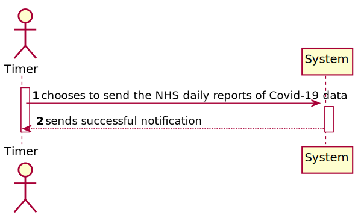
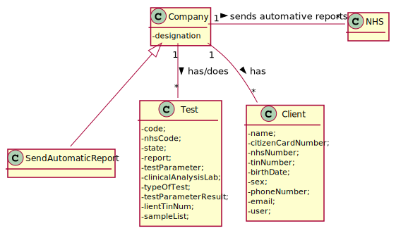
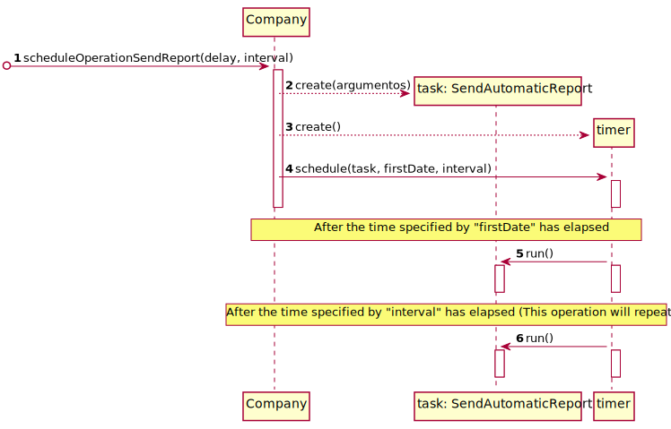
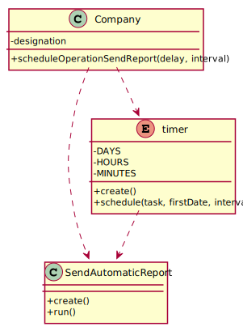

# US 019 - Send the Automatic NHS daily Reports

## 1. Requirements Engineering

### 1.1. User Story Description

The Many Labs company wants to send to the NHS daily reports of Covid-19
data, including the number of observed values and estimated values. Reports should be
generated automatically with historical data and must be sent every day at 6:00 am

### 1.2. Customer Specifications and Clarifications

**From the client clarifications:**

> **Question:** If on a certain day or week there aren't any Covid 19 tests realized and therefore no clients, should we consider the mean age to be 0?
>  
> **Answer:**  Yes, you should consider the mean age to be zero. Sundays should not be considered in your analysis.

----------------------------------------------

> **Question:** Should the reports sent to the NHS be saved in the app, or are they just sent?
>
> **Answer:** There is no need to save the report in the app.

----------------------------------------------

> **Question** Also, should we ask for the prevision interval level or should we just use 95% like it's shown in the example report?
> 
> **Answer** The user should introduce the confidence level value.

-----------------------------------------------
> **Question** Could you clarify how the historical points work? Acording to the NhsReportExample, it was chosen 15 points and the dates to fit 
> the regression model but it seems that it was not chosen the day to start the prediction table.
>
> **Answer:** In the header of the exampleNHSReport.txt file it says "If the administrator selects: The current day to be 31/05/2021...". Please relate this information with the table available in the exampleNHSReport.txt file.
In US19, the current day is the day when the report is sent automatically to the NHS.

-----------------------------------------------

> **Question** The acceptance criteria have "When the system is configured to use the simple linear regression model, 
> the performance of each model should be used to select the best model (the one that uses the number of tests realized or the one that uses the mean age as the independent variable)."
> And a doubt came to my mind...How it is supposed to evaluate the performance of the Simple Linear Regression for the different independent variables??
>
> **Answer:** You should apply anova and from the best r2 you can conclude which fits better.

-----------------------------------------------

> **Q1**: What about US19? Is the significance level, for example, defined in the configuration file?

> **Q2**: Is the same logic applied to the confidence intervals to be on the table?
(In US18, the user chooses the confidence levels? What about US19?)
> 
> **Answer:** Yes the user could be choose the significance level for hip t and confidence level for IC

### 1.3. Acceptance Criteria

* **AC1:** Acceptance Criteria: The report should include day and week (observed and
  estimated) values, the regression model used to estimate each value, R(SLR), R2
  and R2 adjusted for SLR and MLR, hypothesis tests for regression coefficients
  significance model with Anova. Simple linear and multilinear regression models
  can be used to compute the estimates and corresponding confidence intervals.
  When the system is configured to use the simple linear regression model, the
  performance of each model should be used to select the best model (the one that
  uses the number of tests realized or the one that uses the mean age as independent
  variable). The best model will be used to make the estimated/expected values that
  will be send to NHS. The interval of dates to fit the regression model and the
  number of historical points (number of days and number of weeks) must be
  defined through a configuration file. The system should send the report using the
  NHS API (available in moodle).

### 1.4. Found out Dependencies

* There isn't dependencies.

### 1.5 Input and Output Data

**Input Data:**

* Typed data:
	* nothing, it's automatic

**Output Data:**

* The daily reports are sent to the NHS.

### 1.6. System Sequence Diagram (SSD)

**Other alternatives might exist**

### 1.7 Other Relevant Remarks

* Nothing to remark

## 2. OO Analysis

### 2.1. Relevant Domain Model Excerpt 

### 2.2. Other Remarks

* Nothing to remark.

## 3. Design - User Story Realization 

### 3.1. Rationale

| Interaction ID | Question: Which class is responsible for... | Answer  | Justification (with patterns)  |
|:-------------  |:--------------------- |:------------|:---------------------------- |
|Step/Msg 1|Company|scheduleOperationSendReport(delay, interval) |  |
|Msg 2|SendAutomaticReport|create()||
|Msg 3|timer|create()||
|Msg 4|timer|schedule(task, firstDate, interval)||
|Msg 5|SendAutomaticReport|run()||
|Msg 6|SendAutomaticReport|run()||

### Systematization ##

According to the taken rationale, the conceptual classes promoted to software classes are: 

 * Company

Other software classes (i.e. Pure Fabrication) identified: 

 * SendAutomaticReport
 * timer

## 3.2. Sequence Diagram (SD)

## 3.3. Class Diagram (CD)

# 4. Tests 

**Test 1:** Check that it is not possible to create an instance of the Task class with null values. 

	@Test(expected = IllegalArgumentException.class)
		public void ensureNullIsNotAllowed() {
		Task instance = new Task(null, null, null, null, null, null, null);
	}
	

**Test 2:** Check that it is not possible to create an instance of the Task class with a reference containing less than five chars - AC2. 

	@Test(expected = IllegalArgumentException.class)
		public void ensureReferenceMeetsAC2() {
		Category cat = new Category(10, "Category 10");
		
		Task instance = new Task("Ab1", "Task Description", "Informal Data", "Technical Data", 3, 3780, cat);
	}

*It is also recommended to organize this content by subsections.* 

# 5. Construction (Implementation)

## Class CreateTaskController 

		public boolean createTask(String ref, String designation, String informalDesc, 
			String technicalDesc, Integer duration, Double cost, Integer catId)() {
		
			Category cat = this.platform.getCategoryById(catId);
			
			Organization org;
			// ... (omitted)
			
			this.task = org.createTask(ref, designation, informalDesc, technicalDesc, duration, cost, cat);
			
			return (this.task != null);
		}

## Class Organization

		public Task createTask(String ref, String designation, String informalDesc, 
			String technicalDesc, Integer duration, Double cost, Category cat)() {
		
	
			Task task = new Task(ref, designation, informalDesc, technicalDesc, duration, cost, cat);
			if (this.validateTask(task))
				return task;
			return null;
		}

# 6. Integration and Demo 

# 7. Observations

